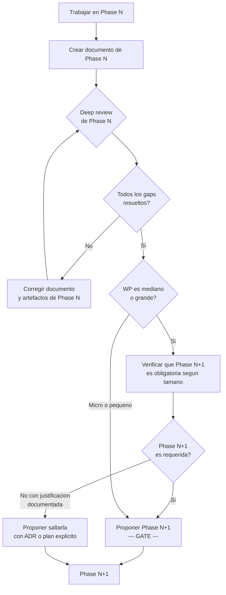

```yml
type: Registro de Deuda Técnica
created_at: 2026-04-03
updated_at: 2026-04-11 22:20:00
```

# Deuda Técnica — THYROX

Registro de problemas conocidos que no se corrigen inmediatamente pero deben
ser atendidos. Cada ítem tiene un ID, descripción, impacto, y criterio de resolución.

## Convenciones

- `[ ]` = Pendiente
- `[-]` = En progreso
- `[x]` = Resuelto (YYYY-MM-DD)
- Severidad: alta | media | baja
- Origen: error registrado (ERR-NNN) o identificado en revisión

---

## TD-001: Timestamps incompletos en metadatos de artefactos

```
Severidad: media
Origen: Revisión 2026-04-03
Fase afectada: Todas (al crear artefactos desde templates)
Estado: [ ] Pendiente
```

**Problema:**
Los templates definen `Fecha: [YYYY-MM-DD-HH-mm-ss]` pero al instanciar artefactos
se usa con frecuencia solo la fecha (`YYYY-MM-DD`) sin el componente de hora.

Ejemplo detectado:
- `voltfactory-adaptation-analysis.md` → `Fecha: 2026-04-03-00-49-34` (correcto)
- `voltfactory-adaptation-solution-strategy.md` → `Fecha: 2026-04-03` (incompleto)

**Impacto:**
Sin el timestamp completo no es posible ordenar artefactos creados el mismo día ni
reconstruir el orden de creación dentro de una sesión. Rompe la trazabilidad temporal.

**Resolución:**
- Corregir todos los artefactos existentes con fecha incompleta
- Agregar regla explícita en `conventions.md`: el campo `Fecha:` en artefactos WP
  debe usar siempre `YYYY-MM-DD-HH-MM-SS` (timestamp real, no estimado)
- Agregar validación en `validate-session-close.sh`: detectar `Fecha: \d{4}-\d{2}-\d{2}$`
  (fecha sin hora) en archivos dentro de `context/work/`

**Criterio de cierre:**
Todos los artefactos en WPs activos tienen timestamp completo. Validación automática
en place.

---

## TD-003: Templates huérfanos en assets/ no referenciados en ningún flujo

```
Severidad: baja
Origen: Auditoría 2026-04-03
Fase afectada: Cross-phase (confusión al buscar templates)
Estado: [ ] Pendiente
```

**Problema:**
Seis templates en `.claude/skills/pm-thyrox/assets/` no están referenciados en
SKILL.md ni en ningún reference activo del flujo. Generan ruido y confusión:
- `ad-hoc-tasks.md.template` — tracking de tareas ad-hoc sin WP formal
- `analysis-phase.md.template` — duplica funcionalidad de `introduction.md.template`
- `categorization-plan.md.template` — no corresponde a ninguna fase del SKILL
- `document.md.template` — template genérico sin fase asignada
- `project.json.template` — metadata de proyecto en JSON (no Markdown)
- `refactors.md.template` — tracking de refactors (podría ser útil en Phase 6)

Nota: `bugfix`, `feature`, `refactor`, `documentation`, `multiple-files`,
`task-completion`, `commit-message-main` son templates de commit — sí están
referenciados en `references/commit-helper.md`.

**Impacto:**
Cuando alguien busca "qué template usar para X", encuentra templates huérfanos
que no tienen instrucciones de uso. Aumenta la fricción y la incertidumbre.

**Resolución:**
Para cada template huérfano, decidir uno de:
1. Mapear a una fase en SKILL.md (si tiene uso legítimo)
2. Mover a `assets/legacy/` con un README explicando que están deprecados
3. Eliminar si no tienen valor (ADR-008: Git as persistence, el historial preserva)

Candidato a mapear: `ad-hoc-tasks.md.template` → Phase 6 para tareas fuera del
task-plan. Candidato a eliminar: `analysis-phase.md.template` (duplica introduction),
`categorization-plan.md.template`, `document.md.template`.

**Criterio de cierre:**
Cero templates en `assets/` sin referencia en SKILL.md o en un reference activo.
Cada template tiene una fase asignada o está en `assets/legacy/`.

---

## TD-002: Phase 3 (PLAN) no produce artefacto en el WP

```
Severidad: alta
Origen: Revisión 2026-04-03
Fase afectada: Phase 3 (PLAN)
Estado: [x] Implementado — FASE 29 (Locked Decision #3 en CLAUDE.md; SKILL.md menciona Git as persistence sin DBs)
```

**Problema:**
Phase 3 solo actualiza [ROADMAP](ROADMAP.md) (archivo global) pero no crea ningún artefacto
dentro del WP. Esto rompe la trazabilidad: al revisar el WP en el futuro no hay
registro de qué scope fue decidido en Phase 3, qué quedó dentro, qué quedó fuera,
ni por qué.

Ejemplo concreto: el WP `voltfactory-adaptation` tiene `analysis/`, `risk-register.md`
y `solution-strategy.md`, pero no hay ningún documento que capture el scope
aprobado en Phase 3.

**Impacto:**
- Un PM que revisa el WP meses después no puede reconstruir qué scope fue aprobado
- No hay forma de detectar scope creep durante Phase 4-6 (no hay baseline documentado)
- El ROADMAP.md agrega items pero no explica el razonamiento detrás de qué quedó fuera

**Resolución:**
1. Crear template `assets/plan.md.template` con:
   - Scope statement (qué problema, quiénes son usuarios, qué es éxito)
   - In-scope: lista de features/componentes aprobados
   - Out-of-scope: lista explícita de lo que NO se hace y por qué
   - Criterios de éxito medibles
   - Link a ROADMAP.md para tracking
2. Actualizar SKILL.md Phase 3: agregar paso para crear `{nombre-wp}-plan.md`
3. Actualizar tabla de artefactos en SKILL.md: agregar Phase 3 → `{nombre-wp}-plan.md`
4. Actualizar estructura de WP en SKILL.md: agregar `{nombre}-plan.md`
5. Crear artefacto retroactivo en WP `voltfactory-adaptation`

**Criterio de cierre:**
SKILL.md Phase 3 produce `{nombre-wp}-plan.md`. Template existe. WP activo tiene el
artefacto. validate-phase-readiness.sh Phase 3 verifica que el archivo existe.

---

## TD-004: SKILL.md supera el límite de tamaño efectivo (~700 líneas)

```
Severidad: alta
Origen: Observación 2026-04-08 (async-gates WP)
Fase afectada: Todas (SKILL.md es el motor de la metodología)
Estado: [x] Implementado — FASE 9/10 (adr.md.template en workflow-analyze/assets/ completo; SKILL.md reducido en FASE 23)
```

**Problema:**
SKILL.md crece con cada FASE. El límite efectivo para que un SKILL se ejecute de
forma confiable es ~700 líneas. Por encima de ese umbral:
- El contexto compacta el SKILL antes de que Claude lo aplique completo
- Las instrucciones al final del archivo (Phase 6, 7) se ignoran con mayor frecuencia
- Gates y convenciones añadidos en FASEs recientes son los más vulnerables

**Impacto:**
El framework crece en instrucciones pero su confiabilidad de ejecución cae.

**Resolución candidata:**
SKILL.md = instrucciones ejecutables mínimas por fase (~1 pantalla por fase).
Detalle extenso → `references/` consultable bajo demanda.
Evaluar si SKILL.md debe invocar references específicos por fase en lugar de
contener todo el texto inline.

**Criterio de cierre:**
SKILL.md ≤ 700 líneas. Instrucciones críticas (gates, pre-flight, task-notification)
verificadas como aplicadas en sesiones reales.

---

## TD-005: Arquitectura monolítica — evaluar evolución a orquestador + agentes por fase

```
Severidad: media
Origen: Observación estratégica 2026-04-08 (async-gates WP)
Fase afectada: Arquitectura general de pm-thyrox
Estado: [ ] Pendiente — requiere WP propio
```

**Problema:**
Diseño actual: "un SKILL que hace todo" (monolítico). A medida que el framework
crece (7 fases, paralelo, gates, agentes especializados), la brecha entre lo que
SKILL.md instruye y lo que los agentes hacen crece también.

Anti-patrones activos:
- **Monolithic SKILL**: crece sin control, no escala a 10+ agentes en paralelo
- **Lógica de coordinación inline**: SKILL contiene lógica que debería estar en agentes especializados
- **Paralelismo sin coordinación formal**: N agentes sin state compartido explícito

**Alternativas a evaluar en WP propio:**
```
A) Todo en 1 SKILL (actual)                → no escala
B) SKILL = orquestador + agentes por fase  → separación de concerns
C) SKILL = solo entrada + agentes todo     → máximo desacoplamiento
D) Hybrid: Agent & Repository + CSP        → decisiones dinámicas con backtracking
E) Event-Driven                            → descartado (no disponible en Claude Code)
```

**Agentes especializados candidatos (si se elige B o D):**
- `Agent-Phase1` — ANALYZE + Stopping Point Manifest
- `Agent-Phase2-3` — SOLUTION_STRATEGY + PLAN
- `Agent-Phase4-5` — STRUCTURE + DECOMPOSE
- `Agent-Phase6` — EXECUTE + manejo de gates async
- `Agent-Phase7` — TRACK + actualización de context files

**Constraint clave:** Solo Claude Code. Coordinación vía `context/now.md` + git.

**Criterio de cierre:**
WP propio analiza 5 alternativas, decide arquitectura, produce ADR permanente.
No implementar sin análisis — este ítem registra la deuda, no la resuelve.

---

## TD-006: thyrox debe ser thin orchestrator — mover lógica de fases a workflow_* commands

```
Severidad: media
Origen: Análisis SKILL vs AGENTE 2026-04-08 (context-hygiene WP)
Fase afectada: Arquitectura del SKILL principal
Estado: [ ] Pendiente — trigger: thyrox SKILL.md llega a ~600 líneas (actualmente 198, OK)
```

**Problema:**
pm-thyrox SKILL viola la definición de SKILL (unidad atómica, una responsabilidad) porque
contiene la lógica completa de las 7 fases. Un SKILL debería ser un thin orchestrator;
la lógica de cada fase debería vivir en su propio command atómico.

**Hallazgo:** Los commands `/workflow_analyze`, `/workflow_plan`, `/workflow_execute`, etc.
ya existen en `.claude/commands/` — la arquitectura correcta está 70% implementada.
Falta: hacer pm-thyrox delgado y sincronizar workflow_* commands con la lógica actual de SKILL.md.

**Cambio concreto:**
- pm-thyrox SKILL: ~50 líneas (descripción, principios core, tabla escalabilidad, refs a workflow_*)
- workflow_analyze.md: contiene lógica completa de Phase 1 (actualmente en pm-thyrox)
- workflow_plan.md: contiene lógica completa de Phase 3 (actualmente en pm-thyrox)
- ... etc. (un command por fase)

**Trigger correcto:** pm-thyrox llega a ~600 líneas O agregar instrucción de fase causa conflicto de contexto.
No antes — workflow_* commands están desactualizados (no tienen gates, Stopping Point Manifest, etc.)
y sincronizarlos requiere un WP formal.

**Criterio de cierre:**
pm-thyrox SKILL ≤ 80 líneas. Cada workflow_* command contiene la lógica de su fase.
workflow_* están sincronizados con todas las instrucciones actuales (gates, manifest, calibración).

### Corrección 2026-04-08 (FASE 21 — skill-architecture-review)

El análisis original (context-hygiene WP, FASE 20) tenía 3 errores de framing:

1. **"SKILL única opción viable"** → Falso. CLAUDE.md es una alternativa más confiable (siempre cargada, sin triggering probabilístico). Ignorar CLAUDE.md fue un error de framing del análisis original.
2. **"Limitación arquitectónica"** → Falso. Es un tradeoff de producto (Anthropic eligió no incluir PTC en Claude Code). La arquitectura de 5 capas es viable y robusta — el límite es de producto, no de diseño.
3. **"Trigger por tamaño (~600 líneas)"** → Incorrecto. El trigger real es confiabilidad: reducir pm-thyrox SKILL a catálogo SIN haber sincronizado los /workflow_* commands produce un sistema peor (Ruta 1 sin lógica + Ruta 2 outdated). El trigger correcto es: **TD-008 completado**.

**Trigger actualizado:** cuando TD-008 esté completo (sync /workflow_* commands), no antes.
**ADR de referencia:** [adr-015.md](decisions/adr-015.md) — documentación completa de la decisión.

---

## TD-007: Phase 1 carece de Step 0 — END USER CONTEXT antes del análisis técnico

```
Severidad: media
Origen: Análisis de cadena de requisitos 2026-04-08 (context-hygiene WP)
Fase afectada: Phase 1 ANALYZE (y por cascada, todas las demás)
Estado: [ ] Pendiente — requiere WP propio
```

**Problema:**
Phase 1 (ANALYZE) incluye "Stakeholders" como el segundo ítem de una lista de 8.
No establece explícitamente quién es el END USER real ni mapea la cadena de traducción
de requisitos entre niveles (END USER → App Programmer → Framework Dev → Platform → Hardware).
Resultado: análisis técnicamente correcto pero desconectado del beneficiario real.

**Las restricciones de bajo nivel afectan al END USER pero no se mapean:**
- "Sin memoria nativa en Claude" → "Phase 7 DEBE actualizar archivos de estado" →
  "El desarrollador puede continuar sin reconstruir contexto"
- Sin el mapa, TD-004/TD-005 fueron identificados como "deuda técnica técnica" en lugar
  de "restricción de plataforma que afecta directamente la experiencia del END USER"

**Solución candidata (Opción B):**
Añadir Step 0 dentro de Phase 1, escalado según tamaño del WP:
- Micro: identificar END USER en una línea
- Pequeño: END USER + restricción principal que sube
- Mediano: cadena completa de traducción + restricciones que suben
- Grande: cadena completa + artefacto separado `*-context.md`

**Criterio de cierre:**
SKILL.md Phase 1 tiene Step 0 explícito. Para WPs Mediano/Grande existe template
`*-context.md` con: END USER, cadena de traducción por niveles, mapa de restricciones,
promesas que podemos y no podemos hacer al END USER.

---

## TD-011: Task-plan sin granularidad atómica — las tareas no son independientemente verificables

```
Severidad: alta
Origen: FASE 21 — error detectado en Phase 5 DECOMPOSE (task-plan de 8 tareas → corregido a 16)
Fase afectada: Phase 5 DECOMPOSE (al crear task-plans)
Estado: [x] Implementado — FASE 29 (validate-session-close.sh Check 5 verifica timestamps en artefactos WP; workflow-decompose/SKILL.md instrucción de atomicidad)
Prioridad: alta (se repite en cada WP)
```

**Problema:**
Una tarea del task-plan debe poder commitearse y verificarse de forma **independiente**.
Si una tarea contiene N operaciones distintas en el mismo archivo o N archivos distintos,
una falla parcial no puede marcarse `[x]` — el commit es ambiguo y la trazabilidad se rompe.

**Síntoma concreto detectado en FASE 21:**
- T-004 original: "Actualizar technical-debt.md" → contenía 4 operaciones (TD-006 + TD-008 + TD-009 + TD-010)
- T-007 original: "Actualizar skill-vs-agent.md" → contenía 4 secciones distintas
- T-001 original: "Crear ADR con todo el contenido" → contenía 3 bloques independientes

**Regla faltante en SKILL.md Phase 5:**
> Una tarea atómica = 1 operación en 1 ubicación. Si la descripción dice "actualizar X con [A, B, C]",
> dividir en 3 tareas: una por cada operación. Si dice "crear Y con secciones [1, 2, 3]", dividir en 3.

**Criterio de atomicidad:**
Una tarea es atómica si: (a) puede fallar sin afectar otras tareas, (b) su commit describe
exactamente un cambio, (c) puede marcarse `[x]` con certeza cuando esa única operación completa.

**Solución:**
Añadir en SKILL.md Phase 5 DECOMPOSE: checklist de atomicidad antes de presentar el task-plan al usuario:
- [ ] Cada tarea toca exactamente 1 ubicación (1 archivo O 1 sección de 1 archivo)
- [ ] Ninguna descripción de tarea contiene "y" conectando dos operaciones distintas
- [ ] Cada tarea puede fallar de forma independiente sin bloquear otras

**Criterio de cierre:**
SKILL.md Phase 5 incluye el checklist de atomicidad. El siguiente WP tiene tareas atómicas desde el inicio.

---

## TD-008: /workflow_* commands desactualizados — sync con lógica actual de SKILL.md

```
Severidad: alta
Origen: FASE 21 — skill-architecture-review (ADR-015)
Fase afectada: Capa 3 — /workflow_* commands (todas las fases)
Estado: [ ] Pendiente — prerequisito bloqueante para TD-006 (reducir pm-thyrox SKILL)
Prioridad: alta
```

**Problema:**
Los 7 commands `/workflow_analyze`, `/workflow_strategy`, `/workflow_plan`, `/workflow_structure`,
`/workflow_decompose`, `/workflow_execute`, `/workflow_track` existen en `.claude/commands/` pero
están desactualizados: no contienen gates async, Stopping Point Manifest, calibración por tamaño,
state-management con `now.md`, ni instrucciones de granularidad atómica añadidas desde su creación.

**Impacto:**
- Ruta B (determinística) del hook está marcada `[outdated]` — no se puede recomendar
- ADR-015 establece que /workflow_* son la "única fuente de verdad de lógica de fase" (D-03) — hoy eso es falso
- Sin TD-008 completado, no se puede reducir pm-thyrox SKILL a catálogo (D-02)

**Trabajo requerido:**
Sincronizar cada command con la lógica actual de SKILL.md:
- Gates async y Stopping Point Manifest (de Phase 1, Phase 6)
- Calibración por tamaño WP (micro/pequeño/mediano/grande)
- State-management: actualizar `now.md` al inicio/fin de cada phase
- Granularidad atómica de tasks (TD-011)
- Añadir `updated_at` en frontmatter de cada command

**Trigger para ejecutar:**
Abrir WP formal dedicado a sync de /workflow_* commands.
Flag `COMMANDS_SYNCED=false` en `session-start.sh` → cambiar a `true` cuando esté completo.

**Criterio de cierre:**
Los 7 /workflow_* commands tienen la lógica completa y actualizada de su fase.
`COMMANDS_SYNCED=true` en `session-start.sh`. pm-thyrox SKILL reducido a catálogo (≤80 líneas).

**Addendum FASE 31:** La interfaz pública es ahora `/thyrox:*` (plugin namespace). Los `workflow-*/SKILL.md` tienen la lógica completa de cada fase y son la implementación interna. `COMMANDS_SYNCED=true` establecido en FASE 31 (T-011). El bloque `[outdated]` ya no aparece en `session-start.sh`.

---

## TD-010: Benchmark empírico — SKILL vs CLAUDE.md vs baseline sin framework

```
Severidad: baja
Origen: FASE 21 — skill-architecture-review (ADR-015 H1/H2/H3)
Fase afectada: Metodología general (decisión de arquitectura)
Estado: [ ] Pendiente — trigger: caso de uso real que justifique el tiempo
```

**Problema:**
ADR-015 documenta hallazgos de terceros sobre SKILL vs CLAUDE.md (H1: triggering probabilístico,
H2: prompt injection, H3: CLAUDE.md alternativa más confiable). Sin embargo, no existe evidencia
empírica propia del proyecto THYROX que compare las tres opciones en condiciones equivalentes.

Las decisiones actuales se basan en evidencia externa (artículo Mar 2026: 40/47 skills empeoran
output, 0/20 disparos en prueba controlada). Un benchmark propio validaría o refutaría esos datos
en el contexto específico de pm-thyrox y el stack de THYROX.

**Benchmark propuesto:**
- 3 tareas equivalentes de gestión PM (analyze, plan, execute)
- 3 condiciones: (A) pm-thyrox SKILL activo, (B) solo CLAUDE.md, (C) sin framework
- Métricas: calidad de output (rubrica 1-5), tasa de activación, líneas de instrucción seguidas

**Trigger para ejecutar:**
Cuando haya caso de uso real que justifique el tiempo (≥1 semana de trabajo).
No ejecutar como ejercicio académico — solo si hay decisión arquitectónica pendiente
que requiera datos propios.

**Criterio de cierre:**
Benchmark ejecutado con ≥3 tareas reales. Resultados en `references/benchmark-skill-vs-claude.md`.
ADR-015 actualizado si los datos contradicen los hallazgos externos.

---

## TD-009: Patrón now-{agent-name}.md no implementado en definiciones de agentes nativos

```
Severidad: media
Origen: FASE 21 — skill-architecture-review (ADR-015 D-08)
Fase afectada: Capa 4 — Agentes nativos (.claude/agents/)
Estado: [ ] Pendiente — trigger: al abrir WP de agentes
```

**Problema:**
ADR-015 D-08 define la convención de naming para state files en ejecución multi-agent:
- `now-{agent-name}.md` para agentes nativos en ejecución (e.g. `now-task-executor.md`)
- `now-{skill-name}-{wp-id}.md` para skills especializados

Sin embargo, ninguna de las 9 definiciones en `.claude/agents/` ni `agent-spec.md` documenta
esta convención ni instruye a los agentes a crear/actualizar su `now-{agent-name}.md`.
Resultado: en ejecución paralela, no hay forma de saber qué agente está activo ni en qué estado.

**Trabajo requerido:**
1. Actualizar `references/agent-spec.md` — añadir campo `state_file` en la spec formal
2. Actualizar las definiciones de agentes que hacen trabajo de ejecución larga:
   - `task-executor.md` — crear `now-task-executor.md` al inicio, actualizar por tarea
   - `task-planner.md` — crear `now-task-planner.md` al inicio
3. Documentar la convención en `references/conventions.md` (TD relacionado: T-011 de FASE 21)

**Trigger para ejecutar:**
Al abrir WP formal de agentes (agent-format-spec o similar).

**Criterio de cierre:**
`agent-spec.md` incluye `state_file` como campo. Los agentes de ejecución larga crean y
actualizan su `now-{agent-name}.md`. La convención está documentada en `conventions.md`.

---

## TD-016: Phase 3 PLAN no verifica existencia de archivos antes de planificar cambios

```
Severidad: alta
Origen: FASE 22 — framework-evolution (Phase 4 STRUCTURE detectó stop-hook-git-check.sh inexistente)
Fase afectada: Phase 3 PLAN (al listar tareas de modificación/eliminación)
Estado: [x] Implementado — FASE 18/19 (campo Stopping Point Manifest en analysis templates; workflow-analyze/SKILL.md paso 9 REQUERIDO)
```

**Problema:**
Durante Phase 3 PLAN (y Phase 4 STRUCTURE), se asumió que `stop-hook-git-check.sh` existía
y requería modificación. En Phase 4 se descubrió que el archivo no existe — la tarea correcta
es "crear", no "modificar". Esta contradicción, si no se detecta, puede generar tareas imposibles
en el task-plan de Phase 5 (e.g. T-001: "editar archivo que no existe").

**Síntoma concreto:**
- FASE 22 Phase 3 PLAN: `TD-013: Añadir verificación stop_hook_active en stop-hook-git-check.sh`
  → implica que el archivo existe
- FASE 22 Phase 4 STRUCTURE: verificación revela que `.claude/skills/pm-thyrox/scripts/stop-hook-git-check.sh`
  **no existe** → la tarea correcta es "crear el archivo con la verificación", no "añadir a un existente"

**Regla faltante en SKILL.md Phase 3:**
> Al listar tareas de "modificar" o "eliminar" archivos, verificar que existen antes de incluirlos
> en el In-Scope. Si no existen, cambiar a "crear". Comando de validación:
> `[ -f "path/archivo" ] && echo "existe" || echo "CREAR"`

**Impacto:**
- Contradicciones entre plan y ejecución
- Tareas de ejecución que fallan con "file not found"
- Trazabilidad rota (task-plan describe una operación diferente a la real)

**Solución:**
Añadir en SKILL.md Phase 3 PLAN, antes de cerrar el In-Scope:

> **Validación de existencia de archivos (obligatoria):**
> Para cada archivo listado como "modificar" o "eliminar":
> - Verificar que existe con `ls path/archivo`
> - Si no existe: cambiar la descripción de la tarea a "crear"
> - Si existe: confirmar que la modificación descrita es coherente con su contenido actual

**Trigger para ejecutar:**
WP de correcciones a SKILL.md (puede añadirse al WP de TD-007 o como FASE 23).

**Criterio de cierre:**
SKILL.md Phase 3 incluye el paso de validación de existencia. El siguiente WP que use Phase 3
no presenta contradicciones entre In-Scope y el estado real del sistema.

---

## TD-017: Criterios de cambio de FASE no están documentados en CLAUDE.md ni SKILL.md

```
Severidad: media
Origen: FASE 22 — pregunta explícita del usuario durante Phase 4 STRUCTURE
Fase afectada: Phase 7 TRACK (cierre de FASE) y Phase 1 ANALYZE (apertura de nueva FASE)
Estado: [x] Implementado — FASE 19 (workflow-execute/SKILL.md menciona commit previo al lanzamiento de gates async)
```

**Problema:**
CLAUDE.md y SKILL.md definen el glosario FASE vs Phase, pero no documentan:
1. **Cuándo se cierra una FASE**: ¿cuando Phase 7 TRACK completa?, ¿cuando el usuario aprueba?, ¿automáticamente?
2. **Cuándo empieza una nueva FASE**: ¿cuando hay una nueva solicitud del usuario?, ¿cuando se abre un nuevo WP?
3. **Qué determina el número de FASE**: ¿secuencial global?, ¿quién asigna el número?
4. **FASE 22 específicamente**: ¿en qué condición se cierra y se pasa a FASE 23?

**Estado actual de FASE 22:**
FASE 22 está en Phase 4 STRUCTURE (aprobación pendiente). Para cerrar FASE 22 se necesita:
- Completar Phase 5 DECOMPOSE → Phase 6 EXECUTE → Phase 7 TRACK
- Phase 7 TRACK produce: lecciones aprendidas, CHANGELOG entry, ROADMAP actualizado, now.md → null

**Regla faltante:**
> Una FASE cambia cuando:
> 1. Phase 7 TRACK completa para el WP activo (lecciones + changelog + ROADMAP)
> 2. El WP activo se marca como `status: complete` en su plan
> 3. `now.md` se actualiza a `phase: complete` y `current_work: null`
> Una nueva FASE empieza cuando se crea un nuevo WP (nuevo directorio en `context/work/`)

**Solución:**
Añadir en CLAUDE.md (sección Glosario) una nota sobre el ciclo de vida de FASE:
> Una FASE = un WP. Se cierra al completar Phase 7 TRACK del WP. La siguiente solicitud
> de trabajo abre una nueva FASE (nuevo WP con timestamp).

Y en SKILL.md Phase 7 TRACK: añadir instrucción explícita de "marcar FASE como cerrada".

**Trigger para ejecutar:**
WP de correcciones a CLAUDE.md/SKILL.md (puede combinarse con TD-016 o TD-007).

**Criterio de cierre:**
CLAUDE.md Glosario incluye nota sobre ciclo de vida. SKILL.md Phase 7 incluye
instrucción de cierre de FASE. El usuario puede determinar en qué FASE está
y cuándo cambia sin necesidad de preguntar.

---

## TD-018: execution-log no respeta formato de timestamp completo

```
Severidad: baja
Origen: Revisión FASE 22 — Phase 6 EXECUTE (2026-04-08)
Fase afectada: Phase 6 EXECUTE (al crear execution-log)
Estado: [ ] Pendiente
```

**Problema:**

Al crear `framework-evolution-execution-log.md` en T-011 se usaron dos formatos incorrectos:

1. **Frontmatter `created_at`:** se usó `2026-04-08` (solo fecha) en lugar del timestamp completo `YYYY-MM-DD HH:MM:SS` que establece la convención del proyecto (TD-001).

2. **Headers de sesión:** se usó `## Sesión N — Bloque X (YYYY-MM-DD)` (solo fecha) en lugar de `## Sesión N — Bloque X (YYYY-MM-DD HH:MM:SS)` con timestamp completo.

**Impacto:**

Inconsistencia con el resto de artefactos del proyecto que usan `created_at: YYYY-MM-DD HH:MM:SS`. Dificulta ordenamiento y correlación temporal de sesiones cuando más de una ocurre en el mismo día.

**Solución:**

1. Al crear un `*-execution-log.md`, el frontmatter debe tener `created_at: YYYY-MM-DD HH:MM:SS` (con hora).
2. Los headers de sesión deben incluir timestamp completo: `## Sesión N — Bloque X (YYYY-MM-DD HH:MM:SS)`.
3. Si no se conoce la hora exacta de inicio de la sesión, usar `$(date '+%Y-%m-%d %H:%M:%S')` al crear el archivo.

**Trigger para ejecutar:**

Corrección al crear el próximo execution-log, o como parte de un WP de limpieza de convenciones.

**Criterio de cierre:**

Todos los execution-log nuevos usan timestamp completo en frontmatter y en headers de sesión. El execution-log de FASE 22 puede corregirse retroactivamente como parte del cierre de FASE.

---

## TD-021: Terminología Phase N debe mapear explícitamente a /workflow_* en thyrox

```
Severidad: media
Origen: Revisión FASE 22 — Sesión 6 (2026-04-08)
Fase afectada: thyrox/SKILL.md (catálogo post-TD-027)
Estado: [x] Implementado — FASE 23/29 (tabla Phase→/workflow-* en thyrox/SKILL.md; TD-019 cerrado FASE 23)
```

**Problema:**

Hay 3 conceptos que ahora coexisten sin distinción clara:

| Concepto | Nivel | Ejemplo |
|----------|-------|---------|
| FASE N | Proyecto global (WP#) | FASE 22: framework-evolution |
| Phase N | Etapa SDLC dentro de un WP | Phase 6: EXECUTE |
| /workflow_* | Skill de ejecución que implementa una Phase | /workflow_execute |

Actualmente pm-thyrox usa "Phase 1: ANALYZE", "Phase 6: EXECUTE" etc. sin referenciar `/workflow_*`. Después de TD-008, el usuario que lee pm-thyrox debe saber:
- Concepto: "Phase 1" = qué es
- Ejecución: "/workflow_analyze" = cómo ejecutarlo

**Solución:**

Actualizar pm-thyrox catálogo (post-TD-027) para mapear explícitamente:
```
| Phase | Concepto | Ejecutar con |
|-------|---------|-------------|
| Phase 1 | ANALYZE | /workflow-analyze |
| Phase 2 | SOLUTION_STRATEGY | /workflow-strategy |
...
```

Y actualizar el glosario de CLAUDE.md para incluir la tercera categoría: `/workflow-*`.

**Trigger para ejecutar:**
Después de TD-019 y TD-027 (reducción SKILL.md).

**Addendum FASE 31:** La tabla de fases en `thyrox/SKILL.md` fue actualizada de `/workflow-*` → `/thyrox:*` (T-013, SPEC-010). La columna "Skill" del catálogo ahora muestra la interfaz pública del plugin.

---

## TD-022: Limitaciones conocidas (triggering probabilístico) no integradas en workflow_* skills

```
Severidad: baja
Origen: Revisión FASE 22 — Sesión 6 (2026-04-08)
Fase afectada: workflow-* skills (todos)
Estado: [ ] Pendiente — la sección "Limitaciones conocidas" fue eliminada de pm-thyrox/SKILL.md en FASE 23 (D-04). Revisar si es necesario integrar en workflow-* skills.
```

**Problema:**

La sección "Limitaciones conocidas y arquitectura objetivo" de pm-thyrox SKILL.md documenta que el triggering de skills es probabilístico (H1/H3). Esta información debe estar en cada workflow_* para que el usuario que llegue directamente a `/workflow_analyze` comprenda el contexto arquitectónico.

La sección también menciona "Arquitectura objetivo (post-TD-008)" que ya fue completado — este texto debe actualizarse.

**Solución:**
1. Integrar en cada workflow_* una nota breve sobre la arquitectura de capas (opcional) y referencia a ADR-015.
2. Actualizar la sección en pm-thyrox para reflejar que TD-008 está completo.

**Trigger para ejecutar:**
Después de TD-019 (estructura definida).

---

## TD-025: skill-authoring.md desactualizado — pre-docs oficiales Claude Code

```
Severidad: baja
Origen: Revisión FASE 23 — análisis docs oficiales (2026-04-09)
Fase afectada: .claude/skills/pm-thyrox/references/skill-authoring.md
Estado: [ ] Pendiente
```

**Problema:**

`skill-authoring.md` es de 2026-03-25, antes de la documentación oficial de Claude Code. Puede contener convenciones desactualizadas o incompletas respecto a:
- Campo `name` (hyphens only — no underscores)
- `disable-model-invocation: true` como optimización de context budget (no solo invocación)
- `user-invocable: false` como opción disponible
- Substituciones: `$ARGUMENTS[N]`, `${CLAUDE_SKILL_DIR}`, `${CLAUDE_SESSION_ID}`
- `context: fork` + `agent:` field

**Referencia:** `references/claude-code-components.md` (creado FASE 23) contiene la información correcta y actualizada.

**Criterio de cierre:**

`skill-authoring.md` actualizado o deprecado con referencia a `claude-code-components.md`.

---

## TD-026: ROADMAP.md supera el límite del Read tool (10000 tokens)

```
Severidad: media
Origen: FASE 25 Phase 7 — error al leer ROADMAP.md completo (2026-04-09)
Fase afectada: Phase 3 PLAN y Phase 7 TRACK (requieren leer/actualizar ROADMAP.md)
Estado: [ ] Pendiente
```

**Problema:**

ROADMAP.md supera los 10000 tokens que el Read tool puede leer en una sola llamada. El error obliga a usar `offset` + `limit` para navegar el archivo por partes, lo que fragmenta el contexto y aumenta el riesgo de omitir secciones relevantes.

Error observado:
```
File content (15204 tokens) exceeds maximum allowed tokens (10000).
Use offset and limit parameters to read specific portions of the file.
```

**Causa raíz:**

ROADMAP.md acumula todo el historial de FASEs en un único archivo flat. Con 25+ FASEs el archivo seguirá creciendo indefinidamente.

**Opciones de resolución (a evaluar en Phase 1 del WP correspondiente):**

1. **Archivo de resumen + archivo de historial**: `ROADMAP.md` contiene solo FASEs activas/pendientes + próximos pasos. `ROADMAP-history.md` (o `context/roadmap-history.md`) acumula FASEs completadas. Read tool puede leer cada parte independientemente.
2. **Secciones por era**: `ROADMAP-v1.md` (FASEs 1-15), `ROADMAP-v2.md` (FASEs 16-30), etc. Rotación cada ~15 FASEs.
3. **ROADMAP.md como índice + archivos por FASE**: Cada WP tiene su sección en `context/work/TIMESTAMP-nombre/FASE-roadmap-entry.md`. ROADMAP.md apunta a ellos. Más fragmentado pero elimina el problema de raíz.

**Criterio de cierre:**

ROADMAP.md (o su reemplazo) puede leerse en una sola llamada sin `offset`/`limit`. El flujo Phase 7 TRACK actualiza el archivo sin errores de token.

---

## TD-027: Criterio de auto-write vs validación humana no implementado en thyrox

```
Severidad: alta
Origen: FASE 25 — comportamiento inconsistente en gates de escritura (2026-04-09)
Fase afectada: Todas — especialmente Phase 3 PLAN, Phase 5 DECOMPOSE, Phase 7 TRACK
Estado: [ ] Pendiente
```

**Problema:**

El skill pm-thyrox no tiene un criterio explícito y aplicado consistentemente para decidir cuándo Claude puede crear/modificar un archivo de forma autónoma vs cuándo debe esperar confirmación humana. En la práctica:

- Archivos de estado operacional (`now.md`, `focus.md`) se actualizan sin gate — correcto.
- Artefactos del WP (análisis, plan, task-plan) se crean sin gate — correcto en fases de exploración.
- Archivos de configuración del framework (`SKILL.md`, `CLAUDE.md`, `ADR-*.md`) se modifican sin confirmación explícita en algunos flujos — riesgo alto.
- El Stopping Point Manifest define SPs pero no los traduce en gates de escritura de archivo de forma sistemática.

**Dimensiones del criterio faltante:**

| Categoría de archivo | Auto-write | Gate humano |
|---------------------|------------|-------------|
| Artefactos WP (`context/work/`) | Siempre | Nunca |
| Estado sesión (`now.md`, `focus.md`) | Siempre | Nunca |
| Referencias (`references/*.md`) | Solo correcciones | Si cambia semántica |
| Configuración framework (`SKILL.md`, `CLAUDE.md`) | Nunca | Siempre |
| ADRs (`decisions/*.md`) | Draft | Aprobación explícita |
| Archivos del proyecto (`ROADMAP.md`, `CHANGELOG.md`) | Phase 7 post-validate | Gate SP-06 |
| Scripts operacionales (`.claude/scripts/*.sh`) | Nunca | Siempre |

**Causa raíz:**

El SKILL.md define Stopping Points (SP-NNN) para gates de fase, pero no los vincula a categorías específicas de archivos. La implementación depende del juicio del LLM en cada sesión, lo que genera inconsistencia.

**Resolución propuesta:**

1. Agregar sección `## Gates de escritura por tipo de archivo` en `pm-thyrox/SKILL.md` con la tabla anterior como regla explícita.
2. Vincular cada SP en el Stopping Point Manifest a la categoría de archivo que desbloquea.
3. Considerar un ADR si la decisión implica cambiar la arquitectura del Stopping Point Manifest.

**Criterio de cierre:**

`pm-thyrox/SKILL.md` tiene sección explícita de gates de escritura. En una sesión de prueba, Claude aplica los gates correctamente sin instrucción adicional del usuario.

---

## TD-028: Sin mecanismo para detectar reclasificacion de tamano de WP entre fases

```
Severidad: media
Origen: FASE 28 — WP reclasificado de pequeno a mediano en Phase 2 (2026-04-09)
Fase afectada: Phase 2 SOLUTION STRATEGY — transition 2→3
Estado: [ ] Pendiente
```

**Problema:**

La clasificacion de tamano del WP (micro / pequeno / mediano / grande) ocurre en Phase 1
ANALYZE y determina que fases son obligatorias. El framework no tiene mecanismo para
re-evaluar el tamano cuando el scope real se descubre en fases posteriores.

Ejemplo concreto en FASE 28:
- Phase 1 clasifico el WP como "pequeno" (3 archivos → fases 1, 2, 6, 7)
- Phase 2 (deep review) revelo que el scope real es 11 archivos → clasificacion "mediano"
- Claude propuso saltar a Phase 5 directamente, omitiendo Phase 3 y Phase 4
- El usuario tuvo que corregir manualmente

**Root cause:**

`workflow-strategy/SKILL.md` no tiene instruccion para re-evaluar el tamano del WP
al terminar la estrategia. La clasificacion de Phase 1 se trata como definitiva, pero
el scope real solo se conoce despues de disenar la solucion.

**Impacto:**

Cuando el scope se expande en Phase 2, Claude salta fases obligatorias para WPs medianos
(Plan, Structure, Decompose), produciendo ejecucion sin especificacion formal.

**Resolucion propuesta:**

Agregar al final de `workflow-strategy/SKILL.md` una seccion de re-evaluacion:

```
## Re-evaluacion de tamano post-estrategia

Antes de proponer la siguiente fase, comparar el scope de la estrategia con la
clasificacion inicial de Phase 1:

| Si el scope cambio a... | Siguiente fase | Fases a agregar |
|------------------------|----------------|-----------------|
| Sigue siendo micro     | Phase 6        | Ninguna |
| Sigue siendo pequeno   | Phase 6        | Ninguna |
| Paso a mediano/grande  | Phase 3 PLAN   | 3, 4, 5 |

Si el tamano subio, actualizar exit-conditions.md con las fases adicionales.
```

**Criterio de cierre:**

`workflow-strategy/SKILL.md` tiene seccion de re-evaluacion de tamano. En una sesion
de prueba donde el scope se expande, Claude detecta el cambio y propone Phase 3 en
lugar de saltar a Phase 5/6.

---

## TD-029: Sin doble validacion al transitar entre fases

```
Severidad: alta
Origen: FASE 28 — Phase 3→4 omitida dos veces (2026-04-09)
Fase afectada: Todas las transiciones de fase
Estado: [ ] Pendiente
```

**Problema:**

Al finalizar una fase, Claude produce el documento correspondiente y propone pasar
directamente a la siguiente fase sin revisar si la fase ANTERIOR esta completa.
El patron se ha repetido dos veces en FASE 28:

1. Phase 2 → propuso saltar a Phase 5 (omitiendo Phase 3)
2. Phase 3 → propuso saltar a Phase 5 (omitiendo Phase 4)

En ambos casos el documento de la phase ACTUAL estaba incompleto o contenia
contradicciones (Phase 3 excluia Phase 4 en un WP mediano).

**Root cause:**

Ningun workflow-*/SKILL.md tiene instruccion para realizar una revision profunda del
documento de la phase ANTERIOR antes de proponer la siguiente. El flujo es:
  - Terminar Phase N → proponer Phase N+1 (sin validacion de Phase N)

Lo correcto es:
  - Terminar Phase N → crear documento Phase N → revisar PROFUNDAMENTE Phase N →
    detectar gaps → corregir → GATE → proponer Phase N+1

**Impacto:**

Documentos de fases con contenido incompleto, inconsistente o auto-contradictorio
pasan a fases posteriores. El error se detecta tarde (o no se detecta), produciendo
ejecucion sin fundamento solido.

**Proceso correcto (no implementado en el framework):**



**Resolucion propuesta:**

Agregar al final de CADA `workflow-*/SKILL.md` una seccion de validacion pre-gate:

```markdown
## Validacion pre-gate (OBLIGATORIO antes de proponer siguiente fase)

1. Releer el documento producido en esta fase completo
2. Deep review: listar todo lo prometido vs lo entregado
3. Verificar risk register: todos los riesgos tienen mitigacion?
4. Verificar consistencia con documentos de fases anteriores
5. Si WP es mediano o grande: confirmar que Phase N+1 es obligatoria
6. Si hay gaps: corregirlos antes de proponer el gate
7. Solo si todo lo anterior esta completo → presentar gate al usuario

El gate es la CONSECUENCIA de la validacion, no el sustituto.
```

**Criterio de cierre:**

Cada `workflow-*/SKILL.md` tiene seccion de validacion pre-gate. En una sesion de
prueba con WP mediano, Claude completa las 7 phases sin que el usuario tenga que
corregir ninguna transicion.

---

## TD-030: Impacto de renombrar "Phase N" a nomenclatura alineada con workflow-*

```
Severidad: baja
Origen: Sugerencia de usuario (2026-04-09)
Fase afectada: Cross-phase (nomenclatura global del framework)
Estado: [ ] Pendiente — requiere analisis de impacto antes de decidir
```

**Problema / Motivacion:**

La nomenclatura actual usa "Phase 1" ... "Phase 7" para las etapas internas del SDLC.
Las alternativas propuestas son:

| Opcion | Ejemplo | Alineacion con skills |
|--------|---------|----------------------|
| Actual | `Phase 1`, `Phase 2`, ..., `Phase 7` | No alineada (numerica) |
| A — kebab numerico | `phase-1`, `phase-2`, ..., `phase-7` | Parcial (kebab-case) |
| B — semantic | `workflow-analyze`, `workflow-strategy`, ..., `workflow-track` | Total (igual que skills) |

**Preguntas a responder en el analisis:**

1. **Frecuencia de uso**: En cuantos archivos aparece "Phase N" con numero?
   (SKILL.md x7, CLAUDE.md, now.md, exit-conditions, plan, task-plan, execution-log, etc.)
2. **Costo de migracion**: Cuantos archivos tendrian que actualizarse?
3. **Beneficio de Opcion B**: "workflow-analyze" es mas semantico que "Phase 1" — pero
   tambien es mas largo. Al escribir `now.md::phase: workflow-execute` vs `phase: Phase 6`,
   cual es mas legible?
4. **Consistencia con glosario**: El glosario en CLAUDE.md distingue FASE (numero global)
   de Phase (etapa interna). Cambiar Phase a workflow-* podria confundir los dos planos.
5. **Impacto en hooks**: Los UserPromptSubmit hooks en workflow-*/SKILL.md actualmente
   ejecutan `set-session-phase.sh "Phase N"`. Con Opcion B seria `set-session-phase.sh "workflow-execute"`.
   El campo `now.md::phase` contendria el nombre semantico — mas legible pero mas largo.
6. **Retrocompatibilidad**: ADRs existentes, artefactos WP y contexto de sesion usan
   "Phase N". Una migracion requeriria sed masivo o convivencia de dos nomenclaturas.

**Beneficio potencial:**

Opcion B elimina la necesidad de memorizar que Phase 6 = EXECUTE. El nombre del skill
invocado y el valor en now.md serian identicos. Reduce friccion cognitiva.

**Criterio de cierre:**

Analisis de impacto completado con:
- Conteo de archivos afectados por opcion
- Decision documentada en ADR (adoptar A, B, o mantener actual)
- Si se adopta cambio: plan de migracion con sed commands y criterio de validacion

**Addendum FASE 31:** La interfaz pública del usuario es ahora `/thyrox:*` — no `/workflow-*`. La opción B (renombrar `Phase N` a nombres semánticos `workflow-*`) pierde relevancia dado que el usuario final no ve `/workflow-*` en el menú. Análisis deferred: evaluar si este TD sigue siendo necesario con el nuevo namespace de plugin.

---

## TD-031: workflow-*/SKILL.md no incluyen instruccion de deep review pre-gate

```
Severidad: alta
Origen: FASE 28 — gaps encontrados en Phase 4 que no fueron detectados por el checklist inicial (2026-04-09)
Fase afectada: Todas las fases (cross-phase)
Estado: [ ] Pendiente
```

**Problema:**

Los `workflow-*/SKILL.md` tienen una seccion de "Gate humano" pero no tienen una
instruccion de deep review antes del gate. El flujo actual es:

```
Crear documento de Phase N → Gate → Phase N+1
```

Lo que deberia ser:

```
Crear documento de Phase N → Deep review (verificar contra fases anteriores) → Corregir gaps → Gate → Phase N+1
```

Evidencia concreta en FASE 28:
- Phase 4 produjo requirements-spec.md y spec-checklist (20/20)
- El spec-checklist se marco como 20/20 sin verificar archivos reales
- Al hacer el deep review manual, se encontraron 4 gaps: design.md faltaba,
  SPEC-003 incompleto, SPEC-004 JSON incorrecto, SPEC-006 sin ubicacion exacta
- Sin el deep review, estos gaps hubieran llegado a Phase 5 DECOMPOSE y luego
  a Phase 6 EXECUTE donde habrian causado errores durante la implementacion

**Impacto:**

Especificaciones incompletas o incorrectas pasan el gate y llegan a Phase 5/6,
donde los errores son mas costosos de corregir.

**Resolucion propuesta:**

Agregar en cada `workflow-*/SKILL.md` una seccion entre la produccion del documento
y el gate humano:

```markdown
## Deep review pre-gate (OBLIGATORIO)

Antes de presentar el gate:

1. Verificar que TODOS los elementos identificados en fases anteriores
   tienen cobertura en el documento de esta fase:
   - Phase 1: cada bug/riesgo identificado tiene una solucion especificada
   - Phase 2: cada decision de diseno (D-NN) tiene un SPEC correspondiente
   - Phase 3: cada item del scope tiene representacion en la spec

2. Verificar contra archivos REALES del repositorio (no asumir):
   - Si la spec menciona una estructura JSON → leer el archivo real
   - Si la spec dice "reemplazar linea X" → confirmar que la linea X existe
   - Si la spec dice "agregar en seccion Y" → confirmar que la seccion Y existe

3. Si se encuentran gaps: corregir el documento antes de presentar el gate

Solo despues de completar el deep review → presentar gate humano
```

Para Phase 4 STRUCTURE especificamente, agregar al final de workflow-structure/SKILL.md:
- Verificar spec contra archivos reales: settings.json, SKILL.md afectados, etc.
- Verificar que se creo design.md si WP es Complejo (10+ tareas)
- Verificar que el spec-checklist se completo con verificacion real, no asumida

**Criterio de cierre:**

Cada `workflow-*/SKILL.md` tiene seccion de deep review pre-gate. En una sesion de
prueba, Claude detecta un gap en la spec (campo real del archivo no reconocido) y
lo corrige antes de presentar el gate, sin que el usuario tenga que indicarlo.


---

## TD-032: GAPs de Phase 6 no prevenidos — checkboxes, execution-log, ROADMAP, SP-Manifest

```
Severidad: alta
Origen: Deep review Phase 6 — FASE 28 (2026-04-09)
Fase afectada: Phase 6 EXECUTE (toda WP mediana o grande)
Estado: [ ] Pendiente
```

**Problema:**

El deep review de Phase 6 encontró 4 gaps que debieron prevenirse con automatismo
o gates explícitos, pero el framework no tenía mecanismo para ello:

| Gap | Descripción | Causa raíz |
|-----|-------------|------------|
| GAP-DR6-01 | Checkboxes del task-plan nunca actualizados a `[x]` durante ejecución | Claude ejecuta cada tarea pero olvida marcar el checkbox — no hay recordatorio automático |
| GAP-DR6-02 | `execution-log.md` no creado al inicio de Phase 6 | La instrucción "REQUERIDO al inicio de sesión" en workflow-execute/SKILL.md es ignorada silenciosamente |
| GAP-DR6-03 | ROADMAP.md sin entrada de la FASE actual | La instrucción del paso 8 ("Actualizar ROADMAP.md") se olvida — no hay validación antes del gate |
| GAP-DR6-04 | SP-Manifest no actualizado cuando el usuario aprueba el GATE OPERACION | Actualizar el manifest es responsabilidad del LLM — sin hook ni recordatorio |

**Impacto:**

Estos gaps solo se detectan en el deep review pre-gate (TD-031). Sin el deep review,
pasarían a Phase 7 TRACK con estado inconsistente: commits hechos pero artefactos
de tracking sin actualizar.

**Soluciones propuestas — dos planos:**

### Plano A: Gates de decisión (instrucciones en SKILL.md)

Agregar en `workflow-execute/SKILL.md` una sección de **Validación pre-tarea** que
requiera, antes de marcar cada tarea como ejecutada:

```
Después de cada tarea:
1. Actualizar checkbox en task-plan: [ ] → [x] (paso 7 — ya existe, reforzar)
2. Si es la primera tarea de la sesión: verificar que execution-log.md existe
3. Después de cada commit: verificar que ROADMAP.md tiene la entrada de la FASE actual
4. Después de aprobar GATE OPERACION: marcar SP-NNN como 'si' en el Stopping Point Manifest
```

Y agregar en la sección de pre-flight de Phase 6 → Phase 7:

```
Pre-flight OBLIGATORIO (antes de proponer Phase 7):
- [ ] Todos los checkboxes en task-plan son [x]
- [ ] execution-log.md existe y tiene estado de cada tarea
- [ ] ROADMAP.md tiene entrada con [x] para la FASE actual
- [ ] SP-Manifest: todos los SP de Phase 6 marcados como 'si'
```

### Plano B: Permisos de herramienta (automatismo via hooks)

- **Checkbox automático:** Un PostToolUse hook que, al detectar un commit con patrón
  `T-NNN` en el mensaje, busque `T-NNN` en el task-plan y actualice `[ ]` → `[x]`.
  Requiere: hook que parsee `git log --oneline -1` para extraer el T-NNN del commit.

- **execution-log guard:** Un UserPromptSubmit hook al inicio de Phase 6 que verifique
  si `*-execution-log.md` existe en el WP activo. Si no existe, emitir warning visible.
  Similar a `project-status.sh` pero enfocado en el artefacto de ejecución.

- **ROADMAP guard:** Agregar a `project-status.sh` una verificación: si hay WP activo,
  buscar el nombre del WP en ROADMAP.md. Si no se encuentra → warning.

- **SP-Manifest automático:** El script `sync-wp-state.sh` podría extenderse para,
  cuando detecta un commit (PostToolUse en Write de task-plan), verificar si hay SP-NNN
  pendiente que corresponda a la fase actual y marcarlo.

**Análisis de viabilidad:**

| Fix | Plano A (instrucción) | Plano B (hook) | Recomendación |
|-----|-----------------------|----------------|---------------|
| Checkboxes | Fácil — agregar paso 7 reforzado | Complejo — parsear commit messages | A primero, B como mejora futura |
| execution-log | Fácil — verificación en pre-flight | Medio — hook UserPromptSubmit | A primero, B en FASE siguiente |
| ROADMAP | Fácil — agregar a pre-flight | Medio — agregar a project-status.sh | A y B en paralelo |
| SP-Manifest | Fácil — instrucción post-GATE | Complejo — requiere contexto de fase | Solo A |

**Criterio de cierre:**

En una sesión de prueba, Phase 6 completa con:
- `validate-session-close.sh` detecta checkboxes sin `[x]` y falla si existen
- `project-status.sh` muestra warning si el WP activo no está en ROADMAP.md
- El execution-log existe antes de ejecutar la primera tarea
- El SP-Manifest se actualiza en el mismo momento que se aprueba cada gate

---

## TD-033: now.md modificado por PostToolUse hook no se incluye en commits automáticamente

```
Severidad: alta
Origen: Deep review FASE 28 — gap identificado en FASE 29 Phase 1 (2026-04-09)
Fase afectada: Todas — especialmente al hacer commits en Phase 6 EXECUTE
Estado: [ ] Pendiente
```

**Problema:**

`sync-wp-state.sh` (PostToolUse hook, FASE 28) modifica `now.md::current_work`
después de cada Write a `context/work/**`. Esto es correcto y funciona. Pero el
cambio en `now.md` queda en estado **uncommitted** hasta el siguiente commit explícito.

Resultado: al presentar un gate (⏸ STOP) o al terminar la sesión, `now.md` puede
estar modificado pero no commiteado. El stop hook detecta este estado como error.

**Ejemplo concreto (FASE 29):**

```
Write analysis.md → PostToolUse → sync-wp-state.sh → now.md::current_work = WP-29
git add analysis.md risk-register.md → commit   ← now.md NO incluido
⏸ GATE Phase 1→2 presentado
Stop hook: "uncommitted changes in now.md"       ← error detectado
```

**Root cause (análisis FASE 29):**

SPEC-002 de FASE 28 definió la postcondición como:
> `now.md::current_work == "work/WP-X/"` — correcto, pero incompleto.

La postcondición real necesaria era:
> `now.md::current_work == "work/WP-X/"` **AND** ese valor está commiteado en git.

La segunda condición nunca se especificó ni validó en los tests de integración (T-017).

**Regla general faltante:**

Antes de cualquier gate (⏸ STOP) y antes de cada commit de artefactos, incluir
siempre `now.md` (y `focus.md` si fue modificado) en el staged set.

```bash
# Patrón correcto de commit en workflow-*/SKILL.md:
git add <artefactos-de-la-fase> .claude/context/now.md
git commit -m "type(scope): descripción"
git push ...
```

**Soluciones propuestas:**

### Plano A — Instrucción en SKILL.md (inmediato)

Agregar en cada `workflow-*/SKILL.md`, en el paso de commit:

```markdown
**Commit de fase** (incluir siempre now.md si fue modificado):
git add <artefactos> .claude/context/now.md
git commit -m "type(scope): descripción"
```

Y en la sección de pre-gate (TD-029/TD-031):
```markdown
Antes de presentar el gate:
- [ ] git status — si now.md aparece como "M", incluirlo en el commit
```

### Plano B — PostToolUse hook extendido (automático)

Extender `sync-wp-state.sh` para que, además de actualizar `now.md`, haga
`git add .claude/context/now.md` automáticamente. Pero esto tiene riesgo:
un `git add` automático puede interferir con staged sets parciales que Claude
está construyendo deliberadamente.

**Análisis de viabilidad Plano B:**

| Opción | Ventaja | Riesgo |
|--------|---------|--------|
| Agregar `git add now.md` en sync-wp-state.sh | Automático, siempre correcto | Interfiere con staged sets deliberados |
| PostToolUse hook separado para git add | Más aislado | Complejidad adicional, mismo riesgo |
| Ningún auto-add — solo instrucción manual | Sin riesgos | Depende del LLM (frágil) |

**Recomendación:** Plano A primero (instrucción explícita en SKILL.md), evaluar
Plano B cuando haya evidencia de que Plano A falla consistentemente.

**Criterio de cierre:**

En una sesión de prueba con WP mediano:
- El stop hook no reporta uncommitted changes en now.md al finalizar ninguna fase
- Al presentar cada gate, `git status` muestra "nothing to commit"
- now.md::current_work está commiteado antes de cada ⏸ STOP

---

## TD-034: CHANGELOG.md supera límite de lectura del Read tool

```yml
id: TD-034
severidad: alta
estado: "[ ] Pendiente"
detectado_en: FASE 29
area: CHANGELOG
```

`CHANGELOG.md` tiene 38,566 bytes (~11,866 tokens) — supera el límite de 10,000 tokens
del Read tool. No se puede leer en una sola llamada. Es el tercer archivo crítico después
de `technical-debt.md` (TD-026-B) y `ROADMAP.md` (TD-026).

**Root cause:** Keep a Changelog no tiene convención de split — el archivo crece
indefinidamente con cada versión publicada. Con 20 versiones a 1,928 bytes/versión,
ya superó el límite en la versión ~17.

**Fix:**
- Crear `CHANGELOG-archive.md` con versiones v0.x + v1.x (13 versiones históricas)
- `CHANGELOG.md` mantiene solo versiones v2.x en adelante
- Agregar regla: al publicar nueva major version → archivar major anterior completa

**Criterio de cierre:**
- `CHANGELOG.md` ≤ 25,000 bytes (margen de seguridad)
- `CHANGELOG-archive.md` existe y contiene versiones archivadas
- SKILL.md actualizado con regla de archivado

---

## TD-035: Sin regla de longevidad para archivos vivos (REGLA-LONGEV-001)

```yml
id: TD-035
severidad: media
estado: "[ ] Pendiente"
detectado_en: FASE 29
area: conventions
```

El framework no tiene ninguna convención que prevenga la acumulación indefinida de
contenido en archivos vivos (archivos que se editan en cada FASE). Esto causó que
`technical-debt.md`, `ROADMAP.md` y `CHANGELOG.md` superaran el límite del Read tool
sin que nadie lo detectara ni previniera.

**Root cause:** `conventions.md` no documenta un umbral de tamaño máximo para archivos
vivos, ni un proceso de archivado/purga periódico.

**Fix — Agregar REGLA-LONGEV-001 en conventions.md:**

```
REGLA-LONGEV-001: Archivos vivos con umbral de tamaño
- Si un archivo vivo (que se edita cada FASE) supera 25,000 bytes:
  → Crear archivo de archivo (nombre-archive.md o nombre-history.md)
  → Mover contenido histórico/cerrado al archivo de archivo
  → El archivo original mantiene solo estado activo/reciente
- Trigger de revisión: cada 5 FASEs, ejecutar wc -c en archivos vivos clave
  Archivos a monitorear: ROADMAP.md, CHANGELOG.md, technical-debt.md
```

**Criterio de cierre:**
- `conventions.md` contiene la regla REGLA-LONGEV-001
- `project-status.sh` o script equivalente alerta si archivo vivo supera 25,000 bytes

---

## TD-036: No existe gate pre-creación de WP en workflow-analyze

```yml
id: TD-036
severidad: media
estado: "[x] Resuelto 2026-04-11 (FASE 31, SPEC-004)"
detectado_en: FASE 31 (análisis profundo 2026-04-11)
area: workflow-analyze / Phase 1
```

**Problema:**

`workflow-analyze/SKILL.md` instruye a Claude a crear los artefactos del WP (directorio,
`analysis.md`, `risk-register.md`, actualizar `now.md`) ANTES de cualquier gate con el usuario.
El único `⏸ STOP` de Phase 1 ocurre AL FINAL — aprueba "continuar a Phase 2", no "crear el WP".

El resultado: cuando el usuario dice "crea un WP", Claude:
1. Crea `context/work/[timestamp]-[nombre]/` (mkdir auto-allow)
2. Crea `analysis/[nombre]-analysis.md` (Write auto-acceptEdits)
3. Crea `[nombre]-risk-register.md` (Write auto-acceptEdits)
4. Actualiza `now.md` (hook sync-wp-state.sh silencioso)
...sin que el usuario haya aprobado nombre, clasificación ni scope del WP.

**Root causes:**

1. Phase 1 fue diseñada como "crear primero, validar después" — el gate al final valida
   calidad del análisis, no la creación en sí.
2. `acceptEdits` + `PostToolUse Write` hook = artefactos WP se crean y sincronizan
   sin ningún prompt de sistema.
3. No existe instrucción en el SKILL que diga "antes de crear, confirmar con usuario".

**Fix — Añadir paso 1.5 en `workflow-analyze/SKILL.md`:**

```
1.5 ⚠ GATE PRE-WP — Antes de crear ningún archivo, confirmar con el usuario:
  - Nombre propuesto: [nombre] (formato kebab-case)
  - Archivos que se crearán: analysis/[nombre]-analysis.md, [nombre]-risk-register.md
  - Reversibilidad: documentation | reversible | irreversible
  - Si now.md tiene WP activo distinto: indicar que se suspende FASE N y se abre FASE M
  Esperar confirmación explícita antes de mkdir ni Write.
```

**Criterio de cierre:**
- `workflow-analyze/SKILL.md` contiene paso 1.5 con gate pre-WP
- El gate ocurre antes de cualquier `mkdir` o `Write` de artefactos WP
- Verificado en al menos una sesión: Claude pide confirmación antes de crear el directorio

---

## TD-037: Edit tool no tiene modo silencioso — imposible suprimir "The file has been updated successfully"

```yml
id: TD-037
severidad: baja
estado: "[x] Resuelto 2026-04-11 — solución arquitectónica: usar subagentes"
detectado_en: FASE 31 (investigación 2026-04-11)
area: plataforma / DX (developer experience)
tipo: patrón arquitectónico — resoluble localmente via subagentes
```

**Problema:**

El Edit tool siempre emite `"The file /path/to/file has been updated successfully."` como
tool result. No existe ningún mecanismo (hook, setting, flag) que permita suprimir o
reemplazar este mensaje — a diferencia del Bash tool que muestra `(Bash completed with
no output)` cuando no hay stdout/stderr.

La diferencia de comportamiento entre herramientas genera ruido visual asimétrico:
- Bash silencioso → `(Bash completed with no output)` — limpio, informativo
- Edit exitoso → `"The file /path/to/file has been updated successfully."` — verboso en secuencias de múltiples edits

**Por qué no se puede resolver con hooks:**

1. `PostToolUse` hooks ejecutan **después** de que el tool result ya fue emitido — no pueden
   suprimir ni reemplazar la salida ya producida.
2. `suppressOutput: true` en hooks solo omite stdout del debug log interno, no el tool result
   visible en la conversación.
3. `PreToolUse` hooks pueden bloquear la herramienta, pero no modificar su output.
4. No existe en Claude Code (a 2026-04-11) un mecanismo de `outputFilter` o equivalente
   para PostToolUse que permita transformar el resultado.

**Workaround descartado:**

Sustituir Edit por `Bash(sed/python)` — rompe diff visible, validación de edits y UX de
revisión. Peor trade-off que aceptar el mensaje verboso.

**Solución (arquitectónica — disponible hoy):**

Usar subagentes (Agent tool) para operaciones que requieren múltiples edits. El Edit tool
corre en el contexto aislado del subagente — su output queda interno y no contamina la
conversación principal. El padre solo ve el resultado final del subagente.

```
❌ Mal: contexto principal → Edit × N → N mensajes en pantalla
✅ Bien: contexto principal → Agent → Edit × N → resumen al padre
```

Confirmado en claude-howto/04-subagents: "Context preservation — Operates in separate
context, preventing pollution of main conversation."

El agente `task-executor` en este proyecto ya implementa este patrón correctamente.

**Referencia:**

Ver análisis completo en:
`context/work/2026-04-11-10-52-25-thyrox-commands-namespace/analysis/edit-tool-silent-mode-finding.md`

**Criterio de cierre:** ✅ Cerrado 2026-04-11 — solución arquitectónica documentada.

---

## TD-038: Reglas `Edit(...)` redundantes en settings.json — ya cubiertas por `defaultMode: acceptEdits`

```yml
id: TD-038
severidad: alta
estado: "[ ] Pendiente"
detectado_en: FASE 31 (análisis 2026-04-11 — Mecanismo A vs B)
area: configuración / settings.json
tipo: deuda de limpieza — reglas redundantes que generan confusión
```

**Problema:**

`settings.json` tiene `"defaultMode": "acceptEdits"`, que auto-aprueba **todas** las operaciones
Edit sin importar la ruta. Las reglas `Edit(...)` en la lista `allow` son por tanto redundantes —
ya están cubiertas por el defaultMode y nunca serán evaluadas individualmente.

Reglas redundantes actuales:

| Regla en `allow` | ¿Necesaria? | Razón |
|-----------------|-------------|-------|
| `Edit(/.claude/context/now.md)` | **No** — redundante | `defaultMode: acceptEdits` ya auto-aprueba este Edit |
| `Edit(/.claude/context/focus.md)` | **No** — redundante | Mismo motivo |
| `Edit(/.claude/context/work/**)` | **No** — redundante | Mismo motivo |

Reglas **necesarias** (deben permanecer):

| Regla en `allow` | ¿Necesaria? | Razón |
|-----------------|-------------|-------|
| `Write(/.claude/context/now.md)` | **Sí** | `acceptEdits` NO cubre Write — solo Edit |
| `Write(/.claude/context/focus.md)` | **Sí** | Mismo motivo |
| `Write(/.claude/context/work/**)` | **Sí** | Mismo motivo |

**Impacto:**

Las reglas redundantes no causan fallos funcionales (la precedencia deny→ask→allow→defaultMode hace
que `allow` gane antes de llegar a defaultMode, produciendo el mismo resultado). Pero:

1. **Confusión conceptual:** Al leer settings.json parece que los Edit necesitan reglas explícitas,
   cuando en realidad `defaultMode: acceptEdits` ya los cubre todos. Esto llevó a registrar reglas
   innecesarias y puede llevar a futuras regresiones si alguien "limpia" settings.json mal.
2. **Falsa sensación de seguridad:** Las reglas Edit explícitas dan la impresión de que solo esos
   paths específicos están auto-permitidos, ocultando que `acceptEdits` auto-permite TODOS los Edit.
3. **Documentación engañosa:** El reference `tool-execution-model.md` usa este settings.json como
   ejemplo canónico — las reglas redundantes propagan el patrón incorrecto.

**Solución:**

Eliminar las 3 reglas `Edit(...)` redundantes de `allow` en `settings.json`. El resultado
funcional es idéntico — `defaultMode: acceptEdits` los cubre. Las reglas `Write(...)` permanecen.

```json
// Antes (con redundancias):
"allow": [
  "Edit(/.claude/context/now.md)",       ← eliminar
  "Write(/.claude/context/now.md)",
  "Edit(/.claude/context/focus.md)",     ← eliminar
  "Write(/.claude/context/focus.md)",
  "Edit(/.claude/context/work/**)",      ← eliminar
  "Write(/.claude/context/work/**)",
  ...
]

// Después (limpio):
"allow": [
  "Write(/.claude/context/now.md)",
  "Write(/.claude/context/focus.md)",
  "Write(/.claude/context/work/**)",
  ...
]
```

Adicionalmente, actualizar `tool-execution-model.md` sección "Configuración Recomendada" para
reflejar el settings.json correcto sin las reglas Edit redundantes.

**Criterio de cierre:**
- `settings.json` no tiene reglas `Edit(...)` en `allow` que sean subconjunto de `defaultMode: acceptEdits`
- `tool-execution-model.md` muestra el ejemplo sin redundancias
- Verificación: `bash .claude/scripts/session-start.sh` sigue funcionando (smoke test)

---

## TD-039: subagent-patterns.md no documenta el mecanismo de invocación async (run_in_background vs background: true)

```yml
id: TD-039
severidad: media
estado: "[ ] Pendiente"
detectado_en: FASE 31 (uso de deep-review agent en background 2026-04-11)
area: references / subagent-patterns.md + agents/*.md
tipo: documentación incompleta — dos planos de async no diferenciados
```

**Problema:**

Hay dos planos de invocación asíncrona de subagentes que `subagent-patterns.md` no distingue:

| Plano | Mecanismo | Quién lo controla |
|-------|-----------|-------------------|
| **Agente** (definición) | `background: true` en frontmatter del `.claude/agents/*.md` | El autor del agente |
| **Orquestador** (invocación) | `run_in_background: true` en la llamada al Agent tool | El agente padre en tiempo de ejecución |

`subagent-patterns.md` Patrón 4 solo muestra `background: true` en el frontmatter, sin documentar la invocación async desde el orquestador.

**Comportamiento del orquestador al usar `run_in_background: true`:**

Cuando el orquestador llama `Agent(run_in_background: true, ...)`, el sistema devuelve:
```
Async agent launched successfully.
agentId: <id>  (internal — usar SendMessage con to: '<id>' para continuar)
output_file: /tmp/.../<id>.output  (JSONL completo — NO leer con Read/Bash)
Do not duplicate this agent's work — avoid working with the same files
```

Este patrón (agentId + SendMessage + output_file) no está documentado en nuestras referencias.

**Gaps específicos:**

1. `subagent-patterns.md` Patrón 4: no menciona `run_in_background` como alternativa al frontmatter
2. `subagent-patterns.md` Patrón 5 (Resumable Agents): menciona `agentId` pero no en contexto de background async
3. Ninguno de los 10 agentes en `.claude/agents/` documenta si es suitable para invocación async
4. El comportamiento de `output_file` (JSONL transcript — no leer directamente, desborda contexto) no está documentado

**Solución propuesta:**

Actualizar `subagent-patterns.md` Patrón 4 para distinguir los dos planos:
- Lado agente: `background: true` en frontmatter (declara compatibilidad)
- Lado orquestador: `run_in_background: true` en el tool call (invocación efectiva)
- Añadir sección sobre el `output_file` y por qué no debe leerse directamente
- Integrar con Patrón 5 el flujo `SendMessage(to: agentId)` para continuar agentes async

Opcionalmente: añadir anotación `async_suitable: true` en agentes como `deep-review`, `task-planner` que son candidatos naturales para background.

**Criterio de cierre:**
- `subagent-patterns.md` distingue frontmatter `background: true` de invocación `run_in_background: true`
- Documenta el output del sistema (agentId, output_file, SendMessage) con ejemplo real
- Al menos 2 agentes tienen anotación de suitability async (o se documenta la regla de cuándo usar async)

---

## TD-040: Gates de fase no instruyen actualizar el artefacto principal al aprobar

```yml
id: TD-040
severidad: media
estado: "[ ] Pendiente"
detectado_en: FASE 31 (pre-gate SP-06, 2026-04-11)
area: workflow-*/SKILL.md — instrucciones de gate (Phase 2→3, 3→4, 4→5, 5→6, 6→7)
tipo: gap de instrucción — now.md se actualiza, artefacto principal no
```

**Problema:**

Todos los `workflow-*/SKILL.md` tienen un gate que dice:
```
Al aprobar: actualizar `context/now.md::phase` a `Phase N+1`.
```

Pero **ninguno** incluye: "también actualizar el artefacto principal de la fase".

Los templates tienen los campos correctos:
- `plan.md.template`: `status: [Pendiente aprobación | Aprobado — YYYY-MM-DD]` + `- [ ] Scope aprobado por usuario — PENDIENTE`
- `solution-strategy.md.template`: `status: [Propuesta/En revisión/Aprobado]`

Pero la instrucción del gate no conecta la acción de aprobación con la actualización de esos campos.

**Caso adicional — `workflow-plan/SKILL.md` no tiene sección "Gate humano":**

A diferencia de los otros 6 workflow skills, `workflow-plan/SKILL.md` no tiene bloque `## Gate humano` ni instrucción `⏸ STOP`. Solo tiene:
- `## Validaciones pre-gate`
- `## Exit criteria` (que menciona `[x] Scope aprobado` como criterio de detección)

El gate está implícito pero no instruccionado → el campo nunca se actualiza.

**Artefactos afectados por WP (patrón sistemático):**

| Artefacto | Campo que queda desactualizado | SKILL que debe corregirse |
|-----------|-------------------------------|--------------------------|
| `*-solution-strategy.md` | `status: En revisión` → debería ser `Aprobado — fecha` | `workflow-strategy/SKILL.md` gate |
| `*-plan.md` | `status: Pendiente aprobación` + `[ ] Scope aprobado` | `workflow-plan/SKILL.md` (añadir Gate humano) |
| `*-requirements-spec.md` | Ningún `status` en frontmatter (gap de template) | `workflow-structure/SKILL.md` gate + template |
| `*-task-plan.md` | No tiene `status` — gate usa exit-conditions.md | Aceptable (exit-conditions cubre) |

**Fix corregido en FASE 31 (WP actual):**
- `plan.md`: `created_at` corregido a `2026-04-11 18:05:14` + `status: Aprobado — 2026-04-11` + `[x] Scope aprobado`
- `solution-strategy.md`: `status: Aprobado — 2026-04-11`

**Solución sistemática:**

Para cada `workflow-*/SKILL.md` con gate, añadir al bloque `Al aprobar`:
```markdown
Al aprobar:
1. Actualizar `context/now.md::phase` a `Phase N+1`
2. Actualizar `{artefacto}::status = Aprobado — {fecha}`  ← AÑADIR ESTO
3. Marcar `[x] {campo-aprobacion}` en el artefacto         ← SI APLICA
```

Adicionalmente, añadir `## Gate humano` a `workflow-plan/SKILL.md` (actualmente ausente).

**Criterio de cierre:**
- `workflow-strategy/SKILL.md` gate incluye actualización de `solution-strategy.md::status`
- `workflow-plan/SKILL.md` tiene sección `## Gate humano` con `Al aprobar` que actualiza `plan.md::status` y `[x] Scope aprobado`
- `workflow-structure/SKILL.md` gate incluye actualización de `requirements-spec.md` (o template añade campo `status`)
- Template `requirements-specification.md.template` tiene campo `status: [Pendiente aprobación | Aprobado — YYYY-MM-DD]`

---

## Procedimiento de cierre de TD (FASE 29)

Cuando un TD se implementa y verifica, seguir este procedimiento:

### Cierre en este archivo

1. Marcar `[x]` con fecha: `[x] 2026-MM-DD`
2. Agregar nota breve: "Implementado en FASE N — {descripción de la corrección}"

### Movimiento al WP resolved (si aplica REGLA-LONGEV-001)

Si `technical-debt.md` supera 25,000 bytes, mover entradas `[-]` y `[x]` antiguas a:
`context/work/{wp-implementador}/{wp}-technical-debt-resolved.md`

Pasos:
1. Verificar: `wc -c .claude/context/technical-debt.md` — si ≥ 25,000 bytes, aplicar split
2. Crear o actualizar `{wp}-technical-debt-resolved.md` desde template (`workflow-track/assets/technical-debt-resolved.md.template`)
3. Copiar entradas `[-]` marcadas en FASEs anteriores a la sección "archivados"
4. Eliminar esas entradas de este archivo
5. Commit: `docs: mover TDs [-] de FASE N a WP resolved`

### Template disponible

`{wp}-technical-debt-resolved.md` — ver `.claude/skills/workflow-track/assets/technical-debt-resolved.md.template`
