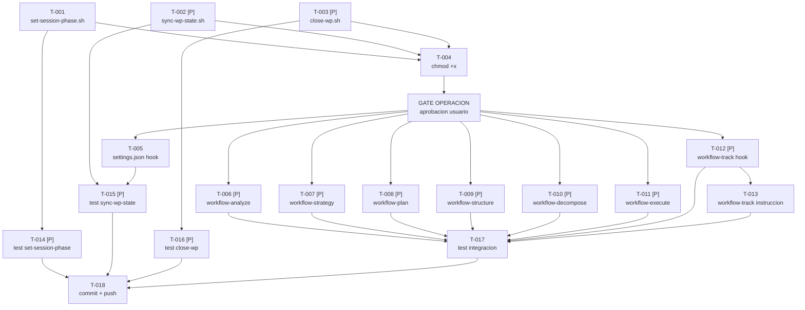

```yml
created_at: 2026-04-09-21-50-00
project: thyrox
feature: auto-operations
breakdown_version: 1.0
total_tasks: 18
critical_dependencies: 4
```

# Task Plan — auto-operations

Implementar sincronizacion determinista de `now.md` via hooks reactivos.
Basado en: `auto-operations-requirements-spec.md` + `auto-operations-design.md`

---

## Estados de tarea

| Estado | Formato |
|--------|---------|
| `[ ]` | Pendiente |
| `[~]` | En progreso |
| `[x]` | Completada |

---

## Fase A — Scripts nuevos (sin GATE)

Los 3 scripts son archivos nuevos. No editan configuracion existente → no requieren GATE OPERACION.

- [ ] [T-001] Crear `.claude/scripts/set-session-phase.sh` (SPEC-001)
- [ ] [T-002] [P] Crear `.claude/scripts/sync-wp-state.sh` (SPEC-002)
- [ ] [T-003] [P] Crear `.claude/scripts/close-wp.sh` (SPEC-003)
- [ ] [T-004] `chmod +x` en los 3 scripts nuevos

> T-001, T-002, T-003 son parallelizables entre si.
> T-004 depende de T-001 + T-002 + T-003.

**CHECKPOINT-A:** Verificar que los 3 scripts existen y son ejecutables.
```bash
ls -la .claude/scripts/set-session-phase.sh .claude/scripts/sync-wp-state.sh .claude/scripts/close-wp.sh
```

---

## GATE OPERACION

⏸ STOP — antes de Fase B, solicitar aprobacion explicita del usuario.
Las ediciones de Fase B modifican configuracion del framework (SKILL.md x7 + settings.json).
Estas ediciones tienen impacto inmediato en el comportamiento de Claude Code.

---

## Fase B — Edicion de configuracion (requieren GATE)

- [ ] [T-005] Agregar `PostToolUse` Write hook en `.claude/settings.json` (SPEC-004)
- [ ] [T-006] [P] Fix hook command en `workflow-analyze/SKILL.md` → `set-session-phase.sh "Phase 1"` (SPEC-005)
- [ ] [T-007] [P] Fix hook command en `workflow-strategy/SKILL.md` → `set-session-phase.sh "Phase 2"` (SPEC-005)
- [ ] [T-008] [P] Fix hook command en `workflow-plan/SKILL.md` → `set-session-phase.sh "Phase 3"` (SPEC-005)
- [ ] [T-009] [P] Fix hook command en `workflow-structure/SKILL.md` → `set-session-phase.sh "Phase 4"` (SPEC-005)
- [ ] [T-010] [P] Fix hook command en `workflow-decompose/SKILL.md` → `set-session-phase.sh "Phase 5"` (SPEC-005)
- [ ] [T-011] [P] Fix hook command en `workflow-execute/SKILL.md` → `set-session-phase.sh "Phase 6"` (SPEC-005)
- [ ] [T-012] [P] Fix hook command en `workflow-track/SKILL.md` → `set-session-phase.sh "Phase 7"` (SPEC-005)
- [ ] [T-013] Reemplazar instruccion LLM de now.md en tabla "REQUERIDO al cerrar WP" de `workflow-track/SKILL.md` por llamada a `close-wp.sh` (SPEC-006)

> T-006..T-012 son parallelizables entre si. T-013 toca la misma seccion de
> workflow-track/SKILL.md que T-012 pero una seccion diferente — ejecutar T-013 DESPUES de T-012.
> T-005..T-013 dependen del GATE OPERACION.

**CHECKPOINT-B:** Verificar que los 7 SKILL.md ya no tienen `echo >>` y que settings.json tiene el hook.
```bash
grep -r "echo 'phase:" .claude/skills/workflow-*/SKILL.md
grep "sync-wp-state" .claude/settings.json
```
Resultado esperado: ninguna linea de grep para el primer comando, 1 linea para el segundo.

---

## Fase C — Validacion

- [ ] [T-014] [P] Probar `set-session-phase.sh`: verificar que reemplaza `phase:` in-place sin duplicar (SPEC-001)
- [ ] [T-015] [P] Probar `sync-wp-state.sh`: simular JSON de PostToolUse y verificar que actualiza `current_work` (SPEC-002)
- [ ] [T-016] [P] Probar `close-wp.sh`: verificar que setea `phase: null` y `current_work: null` (SPEC-003)
- [ ] [T-017] Prueba de integracion: invocar `/workflow-analyze` → verificar que `now.md::phase` se actualiza sin duplicados

> T-014, T-015, T-016 son parallelizables entre si.
> T-017 depende de Fase B completa.

**CHECKPOINT-C:** now.md en estado correcto, sin campos duplicados, con valores validos.

---

## Fase D — Cierre

- [ ] [T-018] Commit y push de todos los cambios de Fase A, B y C

---

## DAG de dependencias



---

## Trazabilidad SPEC → Task

| SPEC | Tasks |
|------|-------|
| SPEC-001 | T-001, T-004, T-014 |
| SPEC-002 | T-002, T-004, T-015 |
| SPEC-003 | T-003, T-004, T-016 |
| SPEC-004 | T-005, T-015 |
| SPEC-005 | T-006, T-007, T-008, T-009, T-010, T-011, T-012 |
| SPEC-006 | T-013 |

---

## Verificacion de atomicidad

- [x] Cada tarea toca exactamente 1 archivo o 1 seccion de 1 archivo
- [x] Ninguna descripcion contiene "y" conectando dos operaciones distintas
  - Excepcion documentada: T-004 (chmod +x 3 scripts) es una sola operacion bash — atoma
- [x] Cada tarea puede commitearse de forma independiente
