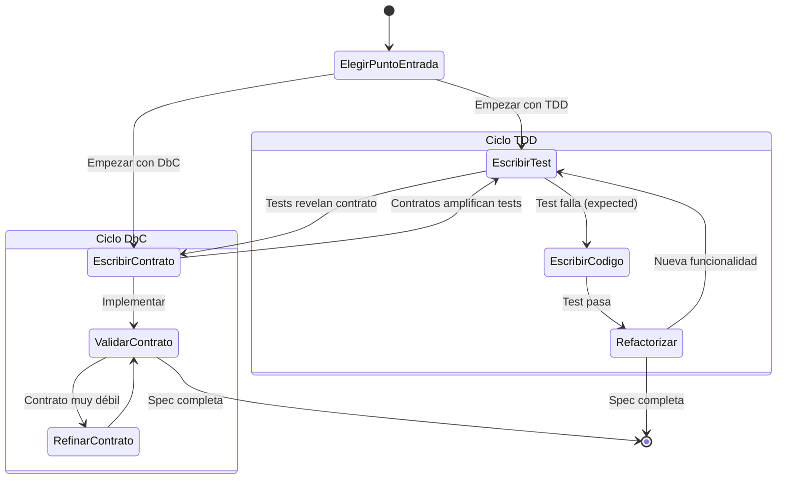
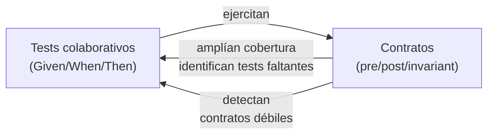
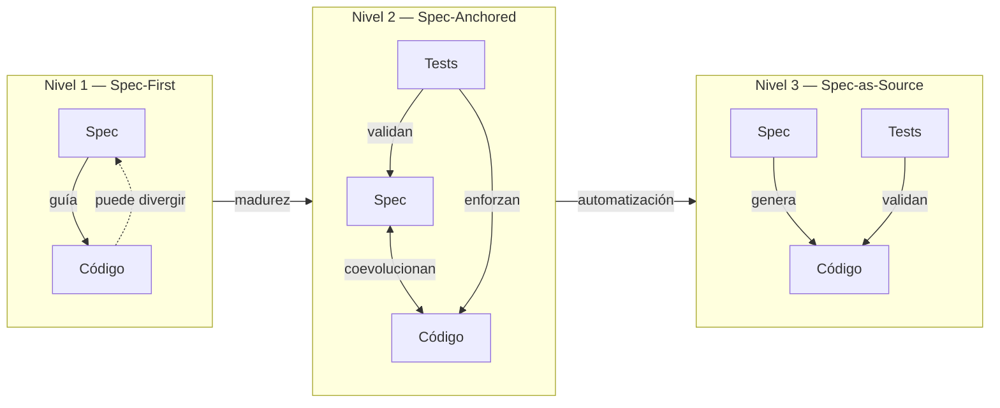
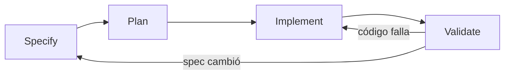

```yml
type: Reference
category: Metodología de Especificación
version: 2.0
purpose: Specification-Driven Development (SDD) — combina TDD y DbC para especificaciones completas y verificables. Incluye tres niveles de rigor y workflow Specify→Plan→Implement→Validate.
source: "Ostroff, Makalsky, Paige — Agile Specification-Driven Development; Spec-Driven Development: From Code to Contract in the Age of AI"
updated_at: 2026-04-11 21:45:00
```

# Specification-Driven Development (SDD)

SDD combina **Test-Driven Development (TDD)** y **Design-by-Contract (DbC)** en un
ciclo único. Los tests y los contratos son dos tipos distintos de especificación —
complementarios, no competidores.

> "Both tests and contracts are different types of specifications, and both are useful
> and complementary for building high quality software."
> — Ostroff, Makalsky, Paige

---

## Los dos tipos de especificación

### Collaborative Specifications (TDD — tests)

Capturan **comportamiento emergente en escenarios concretos**:

```
Given una cuenta con balance $900
When se hace un retiro de $500
Then el balance es $400 y la transacción tuvo éxito
```

**Ventajas:**
- Fáciles de escribir para comportamiento traza (LIFO, secuencias, interacciones)
- Proporcionan punto de cierre claro (el test pasa = unidad lista)
- Amigables para especificaciones colaborativas entre componentes

**Limitaciones:**
- Incompletos: un test cubre un escenario, no todos los inputs posibles
- No documentan precondiciones
- No pueden capturar propiedades universales sin enumerar infinitos casos

### Contractual Specifications (DbC — contratos)

Capturan **comportamiento completo mediante precondiciones, postcondiciones e invariantes**:

```
sort(array):
  require:  count_positive: count > 0
            elements_not_void: ∀i | lower ≤ i ≤ upper • item(i) ≠ Void
  ensure:   sorted: ∀i | lower ≤ i ≤ upper • item(i) ≤ item(i+1)
            count_unchanged: count = old count
```

**Ventajas:**
- Completos: aplican a todos los inputs posibles, no solo a los testeados
- Documentan explícitamente precondiciones
- Actúan como **amplificadores de tests** (los tests ejecutan y validan los contratos)
- Auto-documentan la interfaz de componentes

**Limitaciones:**
- No capturan propiedades traza (ej: LIFO en stacks requiere tests colaborativos)
- Más difíciles de escribir en etapas tempranas cuando los escenarios aún se refinan

---

## El ciclo SDD



**El ciclo no tiene punto de entrada fijo** — puede empezar con tests o con contratos
según el contexto del proyecto.

**Preferencia para empezar con tests:**
1. **Closure** — el test define un punto de cierre claro (pasa = listo)
2. **Collaborative-friendly** — las interacciones entre componentes se capturan mejor con tests que con contratos en etapas tempranas

---

## Sinergias SDD (SDD > max(TDD, DbC))

| TDD le falta | DbC lo tiene |
|-------------|-------------|
| Documentación de diseño | Auto-documentación via contratos |
| Especificación completa de interfaz | Contratos y specs contractuales |

| TDD lo tiene | DbC le falta |
|-------------|-------------|
| Especificaciones colaborativas | Unidades de funcionalidad |
| Tests automatizados | Herramientas sistemáticas de regresión |

**Sinergia clave: Los contratos como amplificadores de tests**



---

## Estructura de una especificación SDD

Una spec SDD completa tiene dos secciones complementarias:

### Sección 1 — Collaborative Specifications

```markdown
## Escenarios (TDD)

### Escenario nominal
Given [estado inicial]
When  [acción]
Then  [resultado esperado]
And   [condición adicional verificable]

### Escenario alternativo
Given [estado inicial con variante]
When  [acción]
Then  [resultado diferente]

### Escenario de error / precondición violada
Given [estado que viola precondición]
When  [acción]
Then  [error explícito, NO comportamiento indefinido]
```

### Sección 2 — Contractual Specifications

```markdown
## Contratos (DbC)

### Precondiciones (require)
- [condición que DEBE ser verdadera antes de la operación]
- [condición 2]

### Postcondiciones (ensure)
- [condición que DEBE ser verdadera después de la operación]
- [relación entre estado antes y después: old value]

### Invariantes (invariant)
- [condición que DEBE ser verdadera SIEMPRE (antes y después)]
```

### Validación de consistencia SDD

Los tests y contratos deben ser **mutuamente consistentes**:

```markdown
## Check SDD
- [ ] Cada precondición tiene al menos un escenario de error que la viola
- [ ] Cada postcondición tiene al menos un escenario nominal que la verifica
- [ ] Los escenarios colaborativos no contradicen los contratos
- [ ] Los contratos no son más débiles que lo que los tests demuestran
- [ ] Las propiedades traza (comportamiento entre llamadas) están en tests, no en contratos
```

---

## Tres niveles de rigor SDD

> Fuente: *Spec-Driven Development: From Code to Contract in the Age of AI*

La adopción de SDD no es binaria. Existen tres niveles progresivos según la madurez
del proyecto y la criticidad del componente:

### Nivel 1 — Spec-First

```
Spec escrita → guía la implementación → puede divergir con el tiempo
```

**Características:**
- La spec se escribe **antes** del código (true spec-first)
- El ciclo TDD clásico (red → green → refactor) toma la spec como punto de partida
- Con el tiempo, la implementación puede divergir de la spec (drift aceptado)
- Apropiado para desarrollo inicial donde los requisitos aún se refinan

**Cuándo usar:** Primera versión de un feature, exploración de diseño, proyectos donde la spec puede cambiar frecuentemente.

### Nivel 2 — Spec-Anchored

```
Spec + código coevolucionan → tests enforzan alineación
```

**Características:**
- Spec y código son **artefactos vivos** que se actualizan juntos
- Los tests ejecutables enforzan que la implementación esté alineada con la spec
- Si un test falla: decidir si actualizar la spec (si el requisito cambió) o el código (si es bug)
- La spec es el "anchor" — el código puede cambiar, pero siempre referenciando la spec

**Cuándo usar:** Features en producción, APIs públicas con versioning, componentes críticos donde la spec es la fuente de verdad pero no necesariamente genera el código.

### Nivel 3 — Spec-as-Source

```
Solo se edita la spec → código generado automáticamente desde contratos
```

**Características:**
- Los contratos DbC son **lo suficientemente precisos** para generar código
- Humanos solo editan la spec; el código es un artefacto derivado
- Requiere herramientas de generación (LLMs, compiladores de contratos, etc.)
- La capa TDD valida el código generado contra los escenarios

**Cuándo usar:** Componentes con interfaces formales bien definidas, código boilerplate o repetitivo, contextos donde los errores de implementación tienen alto costo.

### Comparación de niveles



---

## Workflow 4-fases: Specify → Plan → Implement → Validate

> Estructura universal que aplica a los tres niveles, con variaciones por nivel.



| Fase | Qué ocurre | Equivalente THYROX |
|------|-----------|-------------------|
| **Specify** | Escribir collaborative specs (TDD) + contratos (DbC) | Phase 4: STRUCTURE |
| **Plan** | Mapear specs a tareas de implementación | Phase 5: DECOMPOSE |
| **Implement** | Desarrollar guiado por spec (TDD: red→green→refactor) | Phase 6: EXECUTE |
| **Validate** | Verificar alineación spec-implementación | Phase 7: TRACK |

**Variaciones por nivel:**

| Fase | Spec-First | Spec-Anchored | Spec-as-Source |
|------|-----------|---------------|----------------|
| Specify | Spec completa antes de código | Spec inicial; evoluciona con código | Spec formal con contratos precisos |
| Plan | Extraer tareas de la spec | Mapear specs a tests ejecutables | Definir generador/template |
| Implement | TDD clásico guiado por spec | Código + spec coevolucionan | Generación automática desde spec |
| Validate | Verificar; aceptar drift controlado | Tests enforzan alineación | Regenerar si contratos cambian |

---

## SDD en THYROX — Mapeo de conceptos

| Concepto SDD | Equivalente THYROX |
|-------------|-------------------|
| Collaborative test | `Given/When/Then` en requirements-spec.md |
| Contract (precondición) | `Given` clause — estado previo requerido |
| Contract (postcondición) | `Then` clause — estado posterior garantizado |
| Contract (invariante) | Restricciones que aplican a todos los escenarios del componente |
| Test amplification | Los contratos revelan escenarios Given/When/Then faltantes |
| Nivel Spec-First | Phase 4 antes de Phase 6 — spec guía implementación |
| Nivel Spec-Anchored | Phase 4 + Phase 7 TRACK — spec y código coevolucionan |
| Nivel Spec-as-Source | Futuro: code gen desde contratos DbC |

**Extensión SDD sobre Phase 4 STRUCTURE:**

Phase 4 (workflow-structure) produce requirements-spec con Given/When/Then → esto es **TDD puro** (collaborative tests, Nivel Spec-First). La extensión SDD agrega la **capa contractual** (precondiciones, postcondiciones, invariantes) y, si el proyecto lo requiere, sube al Nivel Spec-Anchored o Spec-as-Source.

---

## Cuándo usar SDD vs Phase 4 puro vs TDD puro

| Contexto | Recomendación | Comando |
|----------|--------------|---------|
| WP de infraestructura / configuración | Phase 4 (TDD puro es suficiente) | `/thyrox:structure` |
| Acceptance criteria rápidos, traza, secuencias | TDD puro | `/thyrox:test-driven-development` |
| Feature con lógica de negocio compleja | SDD completo (TDD + DbC), Nivel Spec-First | `/thyrox:spec-driven` |
| API / interfaz pública de componente | SDD completo, Nivel Spec-Anchored | `/thyrox:spec-driven` |
| Comportamiento con muchas variantes de input | SDD completo (contratos cubren todos los inputs) | `/thyrox:spec-driven` |
| Comportamiento traza / secuencias entre objetos | TDD puro (contratos no capturan esto bien) | `/thyrox:test-driven-development` |
| Generación de código desde specs | SDD, Nivel Spec-as-Source | `/thyrox:spec-driven` |

---

## Árbol de decisión — ¿Qué comando usar?

```mermaid
flowchart TD
    Q1{¿Hay WP activo\ny es Phase 4?}
    Q1 -->|Sí| ST[/thyrox:structure\nPhase 4 completa del WP]
    Q1 -->|No| Q2{¿Lógica de negocio\ncompleja / API pública\n/ múltiples inputs?}

    Q2 -->|Sí| Q3{¿Necesitas\ncontratos DbC?}
    Q2 -->|No| TDD[/thyrox:test-driven-development\nTDD puro]

    Q3 -->|Sí| SDD[/thyrox:spec-driven\nTDD + DbC]
    Q3 -->|No| TDD

    SDD --> Q4{¿Qué nivel?}
    Q4 -->|Primera versión| SF[Spec-First]
    Q4 -->|Feature en prod| SA[Spec-Anchored]
    Q4 -->|Code gen| SS[Spec-as-Source]
```

---

## Referencias

- Paper 1: Ostroff, Makalsky, Paige — *Agile Specification-Driven Development* (York University / University of York)
- Paper 2: *Spec-Driven Development: From Code to Contract in the Age of AI*
- [`workflow-structure/SKILL.md`](../skills/workflow-structure/SKILL.md) — Phase 4 STRUCTURE (TDD puro)
- `commands/spec-driven.md` → `/thyrox:spec-driven` — SDD completo (TDD + DbC, tres niveles)
- `commands/test-driven-development.md` → `/thyrox:test-driven-development` — TDD puro
