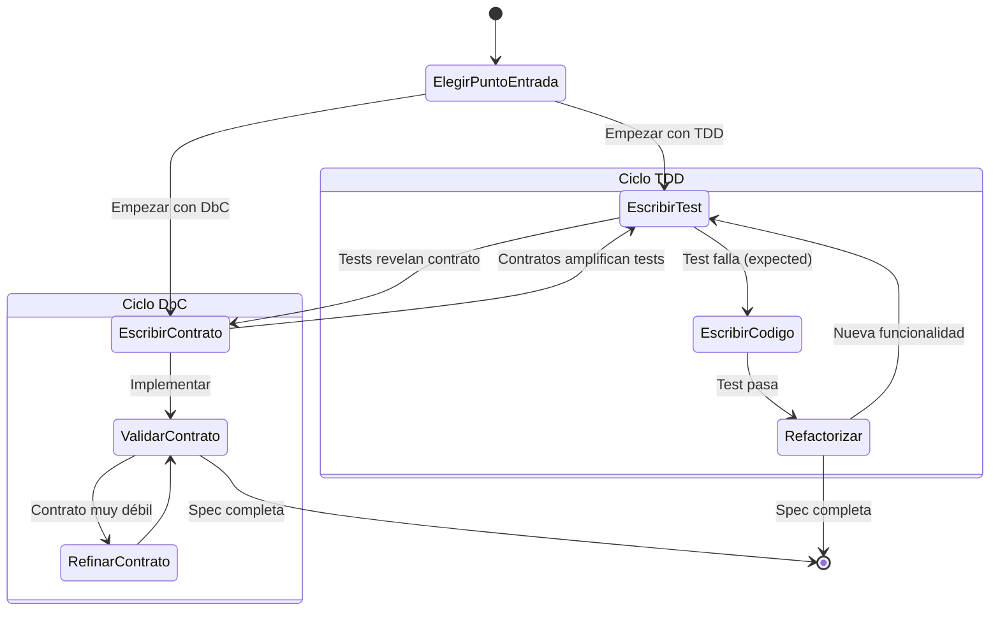
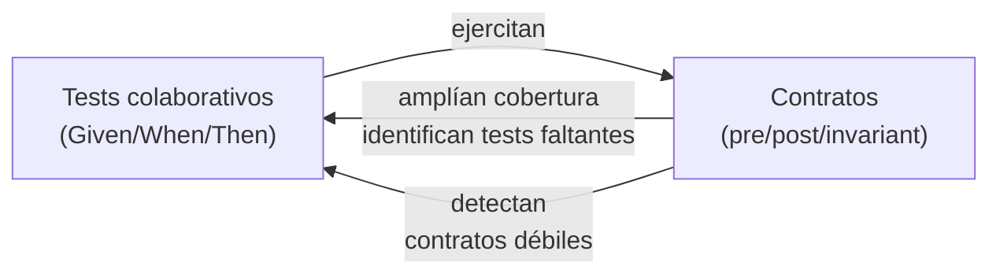

```yml
type: Reference
category: Metodología de Especificación
version: 1.0
purpose: Specification-Driven Development (SDD) — combina TDD y DbC para especificaciones completas y verificables
source: "Ostroff, Makalsky, Paige — Agile Specification-Driven Development"
updated_at: 2026-04-11 20:41:54
```

# Specification-Driven Development (SDD)

SDD combina **Test-Driven Development (TDD)** y **Design-by-Contract (DbC)** en un
ciclo único. Los tests y los contratos son dos tipos distintos de especificación —
complementarios, no competidores.

> "Both tests and contracts are different types of specifications, and both are useful
> and complementary for building high quality software."
> — Ostroff, Makalsky, Paige

---

## Los dos tipos de especificación

### Collaborative Specifications (TDD — tests)

Capturan **comportamiento emergente en escenarios concretos**:

```
Given una cuenta con balance $900
When se hace un retiro de $500
Then el balance es $400 y la transacción tuvo éxito
```

**Ventajas:**
- Fáciles de escribir para comportamiento traza (LIFO, secuencias, interacciones)
- Proporcionan punto de cierre claro (el test pasa = unidad lista)
- Amigables para especificaciones colaborativas entre componentes

**Limitaciones:**
- Incompletos: un test cubre un escenario, no todos los inputs posibles
- No documentan precondiciones
- No pueden capturar propiedades universales sin enumerar infinitos casos

### Contractual Specifications (DbC — contratos)

Capturan **comportamiento completo mediante precondiciones, postcondiciones e invariantes**:

```
sort(array):
  require:  count_positive: count > 0
            elements_not_void: ∀i | lower ≤ i ≤ upper • item(i) ≠ Void
  ensure:   sorted: ∀i | lower ≤ i ≤ upper • item(i) ≤ item(i+1)
            count_unchanged: count = old count
```

**Ventajas:**
- Completos: aplican a todos los inputs posibles, no solo a los testeados
- Documentan explícitamente precondiciones
- Actúan como **amplificadores de tests** (los tests ejecutan y validan los contratos)
- Auto-documentan la interfaz de componentes

**Limitaciones:**
- No capturan propiedades traza (ej: LIFO en stacks requiere tests colaborativos)
- Más difíciles de escribir en etapas tempranas cuando los escenarios aún se refinan

---

## El ciclo SDD



**El ciclo no tiene punto de entrada fijo** — puede empezar con tests o con contratos
según el contexto del proyecto.

**Preferencia para empezar con tests:**
1. **Closure** — el test define un punto de cierre claro (pasa = listo)
2. **Collaborative-friendly** — las interacciones entre componentes se capturan mejor con tests que con contratos en etapas tempranas

---

## Sinergias SDD (SDD > max(TDD, DbC))

| TDD le falta | DbC lo tiene |
|-------------|-------------|
| Documentación de diseño | Auto-documentación via contratos |
| Especificación completa de interfaz | Contratos y specs contractuales |

| TDD lo tiene | DbC le falta |
|-------------|-------------|
| Especificaciones colaborativas | Unidades de funcionalidad |
| Tests automatizados | Herramientas sistemáticas de regresión |

**Sinergia clave: Los contratos como amplificadores de tests**



---

## Estructura de una especificación SDD

Una spec SDD completa tiene dos secciones complementarias:

### Sección 1 — Collaborative Specifications

```markdown
## Escenarios (TDD)

### Escenario nominal
Given [estado inicial]
When  [acción]
Then  [resultado esperado]
And   [condición adicional verificable]

### Escenario alternativo
Given [estado inicial con variante]
When  [acción]
Then  [resultado diferente]

### Escenario de error / precondición violada
Given [estado que viola precondición]
When  [acción]
Then  [error explícito, NO comportamiento indefinido]
```

### Sección 2 — Contractual Specifications

```markdown
## Contratos (DbC)

### Precondiciones (require)
- [condición que DEBE ser verdadera antes de la operación]
- [condición 2]

### Postcondiciones (ensure)
- [condición que DEBE ser verdadera después de la operación]
- [relación entre estado antes y después: old value]

### Invariantes (invariant)
- [condición que DEBE ser verdadera SIEMPRE (antes y después)]
```

### Validación de consistencia SDD

Los tests y contratos deben ser **mutuamente consistentes**:

```markdown
## Check SDD
- [ ] Cada precondición tiene al menos un escenario de error que la viola
- [ ] Cada postcondición tiene al menos un escenario nominal que la verifica
- [ ] Los escenarios colaborativos no contradicen los contratos
- [ ] Los contratos no son más débiles que lo que los tests demuestran
- [ ] Las propiedades traza (comportamiento entre llamadas) están en tests, no en contratos
```

---

## SDD en THYROX — Mapeo de conceptos

| Concepto SDD | Equivalente THYROX |
|-------------|-------------------|
| Collaborative test | `Given/When/Then` en requirements-spec.md |
| Contract (precondición) | `Given` clause — estado previo requerido |
| Contract (postcondición) | `Then` clause — estado posterior garantizado |
| Contract (invariante) | Restricciones que aplican a todos los escenarios del componente |
| Test amplification | Los contratos revelan escenarios Given/When/Then faltantes |

**Extensión SDD sobre Phase 4 STRUCTURE:**

Phase 4 (workflow-structure) produce requirements-spec con Given/When/Then → esto es **TDD puro** (collaborative tests). La extensión SDD agrega la **capa contractual** (precondiciones, postcondiciones, invariantes) que hace la spec completa y auto-verificable.

---

## Cuándo usar SDD vs Phase 4 puro

| Contexto | Recomendación |
|----------|--------------|
| WP de infraestructura / configuración | Phase 4 (TDD puro es suficiente) |
| Feature con lógica de negocio compleja | SDD completo (TDD + DbC) |
| API / interfaz pública de componente | SDD completo (los contratos documentan el interface) |
| Comportamiento con muchas variantes de input | SDD completo (los contratos cubren todos los inputs) |
| Comportamiento traza / secuencias entre objetos | TDD puro (los contratos no capturan esto bien) |

---

## Referencias

- Paper: Ostroff, Makalsky, Paige — *Agile Specification-Driven Development* (York University / University of York)
- [`workflow-structure/SKILL.md`](../skills/workflow-structure/SKILL.md) — Phase 4 STRUCTURE (TDD puro)
- `commands/spec.md` → `/thyrox:spec` — comando SDD completo (TDD + DbC)
