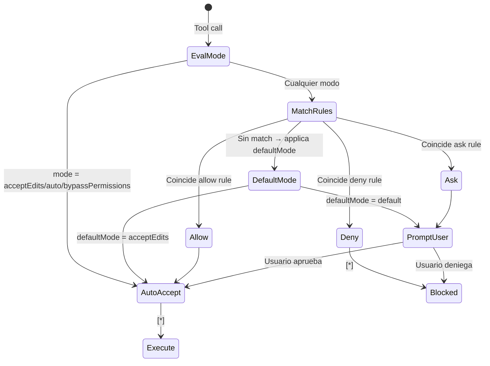
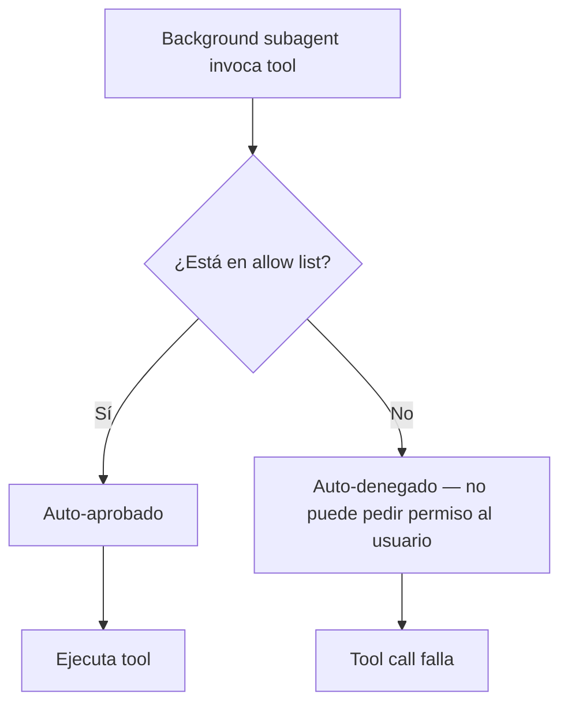
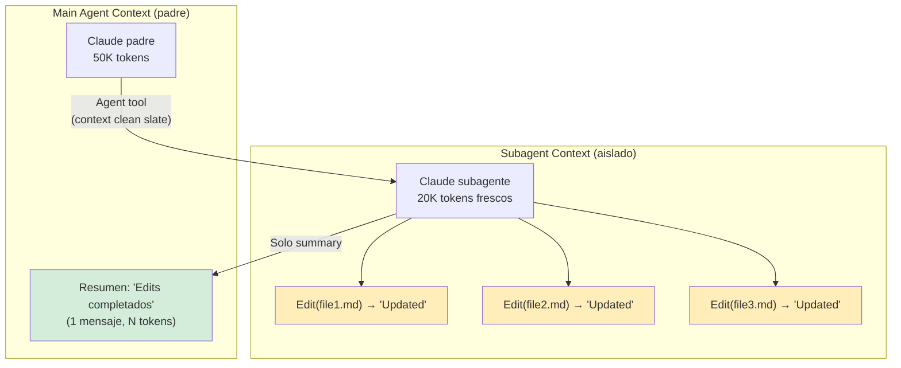
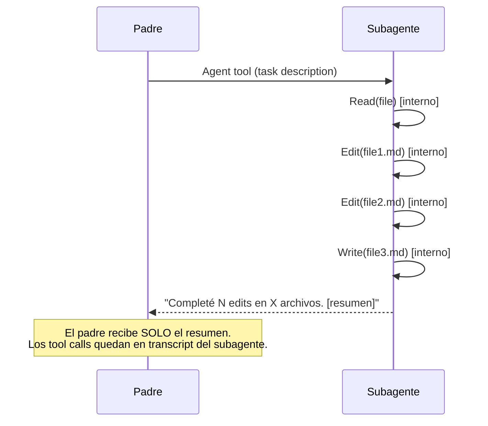
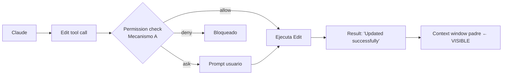
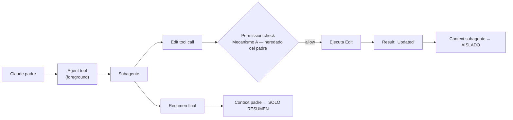
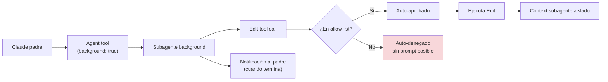
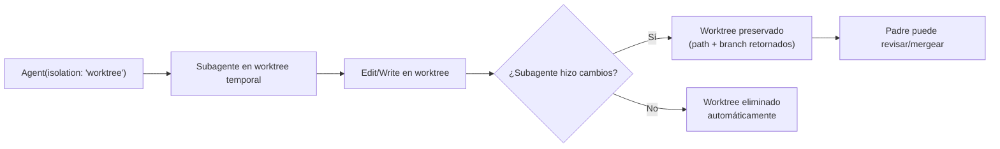
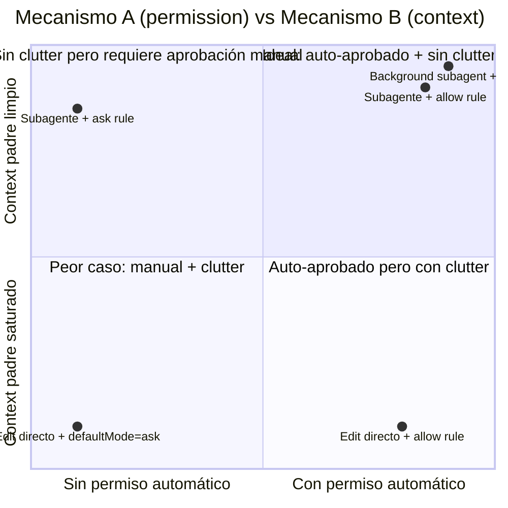

```yml
type: Reference
category: Claude Code Platform — Tool Execution
version: 1.0
purpose: Documentar todos los flujos de ejecución de Edit/Write y el modelo de permisos de herramientas
source: claude-howto deep-review + comportamiento observado
updated_at: 2026-04-11 20:26:31
```

# Tool Execution Model — Edit/Write Flows y Permission Model

Referencia unificada de dos mecanismos distintos que con frecuencia se confunden:

**Mecanismo A — Permission/Approval:** El harness de Claude Code decide si solicitar aprobación
antes de ejecutar una herramienta. Configurado en `settings.json`.

**Mecanismo B — Context Isolation:** El modelo Claude decide si ejecutar edits directamente
o delegarlos a un subagente. Afecta qué aparece en el context window del padre.

Estos mecanismos son **completamente independientes**. Un Edit puede ser auto-aprobado (sin
prompt) pero aún así saturar el context window del padre. Un subagente puede requerir
aprobación explícita (si el harness está en modo `default`) pero aislar el clutter.

---

## Mecanismo A — Permission/Approval Model

### Los 6 Permission Modes

| Mode | Comportamiento | Uso típico |
|------|---------------|-----------|
| `default` | Read: auto · Edit/Write: prompt · Bash: prompt | Sesión interactiva conservadora |
| `acceptEdits` | Read+Edit+Write: auto · Bash: prompt | Trabajo en archivos, sin shell libre |
| `plan` | Solo read, sin edits ni commands | Investigación / análisis |
| `dontAsk` | Solo herramientas pre-aprobadas en `allow` list | CI/CD, automatización |
| `auto` | Todas las acciones con safety classifier (Research Preview, Team/Enterprise) | Autonomía total con guardrails |
| `bypassPermissions` | Sin checks (peligroso) | Testing interno |



> **Precedencia:** `deny` siempre gana → luego `ask` → luego `allow` → luego `defaultMode`.
> El primer match en ese orden determina el resultado.

### Estructura de settings.json

```json
{
  "defaultMode": "acceptEdits",
  "permissions": {
    "allow": [
      "Write(/context/work/**)",
      "Bash(git add *)",
      "Bash(git commit *)"
    ],
    "ask": [
      "Edit(/.claude/scripts/*.sh)",
      "Edit(/.claude/settings.json)"
    ],
    "deny": [
      "Bash(git push --force *)",
      "Bash(rm -rf *)"
    ]
  }
}
```

**Nota:** Con `defaultMode: acceptEdits`, las reglas `Edit(...)` en `allow` son redundantes — ya están cubiertas por el defaultMode. Solo agregar reglas `Edit(...)` explícitas en `allow` cuando se necesite sobreescribir un `deny` específico.

**Semántica de patrones:**
- `Write(/context/work/**)` — ruta absoluta desde raíz del proyecto, soporta `*` y `**`
- `Bash(git add *)` — el `*` después del espacio acepta cualquier argumento
- Las reglas en `allow`/`ask`/`deny` anulan el `defaultMode` para los patrones que coinciden

### Herencia en Subagentes

Un subagente puede tener su propio `permissionMode` declarado en su YAML frontmatter:

```yaml
---
name: task-executor
description: Ejecutor de tareas atómicas
permissionMode: acceptEdits
---
```

- El `permissionMode` del subagente es **independiente** del del padre
- Las reglas `allow`/`ask`/`deny` de `settings.json` **se heredan** del padre al subagente
- Si el subagente tiene `permissionMode: acceptEdits`, auto-acepta Edits aunque el padre esté en `default`

### Background Subagents y Pre-aprobación

Los subagentes en background (`background: true`) **auto-deniegan cualquier permiso no pre-aprobado**:



"Pre-aprobado" = explícitamente en la lista `allow` de `settings.json`. Los modos
`acceptEdits` o `auto` NO son suficientes para background agents — las reglas `allow`
son el único mecanismo.

---

## Mecanismo B — Context Isolation (Subagent vs Main)

### El Problema: Context Pollution

Cuando Claude llama Edit/Write directamente en el contexto principal, cada call produce
un resultado visible en el context window:

```
→ Edit(file1.md) → "The file has been updated successfully."    [+N tokens]
→ Edit(file2.md) → "The file has been updated successfully."    [+N tokens]
→ Edit(file3.md) → "The file has been updated successfully."    [+N tokens]
```

En una sesión con 20 edits, esto consume tokens y hace el context difícil de navegar.

### La Solución: Subagent Context Isolation



**Consecuencia clave:**
- ❌ `Main → Edit × N` = N mensajes "The file has been updated successfully." en el context padre
- ✅ `Main → Agent → Edit × N` = 1 resumen en el context padre, N mensajes quedan en el context del subagente

El subagente usa **su propio context window separado** ("fresh context window"). Los resultados de
Edit/Write son visibles en el transcript del subagente
(`.claude/projects/{id}/subagents/agent-{id}.jsonl`) pero **no saturan el context del padre**.

### Cuándo el Subagente Devuelve Resultados

El padre solo recibe el **output final del subagente** (lo que el subagente escribe en su respuesta),
no el histórico de tool calls. El "resultado destilado" es:



---

## Todos los Flujos donde Aparece Edit/Write

### Flujo 1: Edit Directo en Contexto Principal



**Características:**
- Resultado visible en context del padre
- Aprobación determinada por settings.json
- N edits = N resultados en context

### Flujo 2: Edit en Subagente Foreground



**Características:**
- Resultado de Edit queda en context del subagente (aislado)
- Padre solo recibe el resumen final del subagente
- El `permissionMode` del subagente puede diferir del padre

### Flujo 3: Edit en Subagente Background



**Características:**
- Sin acceso al usuario para pedir permiso → requiere pre-aprobación via `allow` rules
- Context aislado igual que foreground
- El padre recibe notificación cuando el background task completa

### Flujo 4: Edit en PostToolUse Hook

```mermaid
flowchart LR
    A[Tool call principal] --> B[Tool execution]
    B --> C[PostToolUse hook trigger]
    C --> D["bash script\no Python"]
    D --> E{¿Script llama Edit?}
    E -->|Sí| F["Edit desde shell\n(fuera del context window)"]
    E -->|No| G["additionalContext\n(inyección en transcript)"]
    F --> H[Archivo modificado]
    H --> I[Context padre NO VE el edit\n(fue desde shell)]
```

**Nota crítica:** Los hooks ejecutan comandos shell externos. Si el hook modifica archivos
directamente vía `bash`, ese cambio no pasa por el Mecanismo A (permission check) ni por
el Mecanismo B (context isolation) — es una operación shell directa. El context del padre
**no verá** "The file has been updated successfully." — el hook es opaco al LLM.

Ver `hook-output-control.md` para la semántica completa de `suppressOutput`.

### Flujo 5: Edit en Scheduled Task (/loop)

```mermaid
flowchart LR
    A[/loop command] --> B[Scheduled execution\nen subagente aislado]
    B --> C[Edit tool call]
    C --> D{Permission check}
    D -->|allow en settings| E[Auto-aprobado]
    D -->|ask en settings| F["NO PUEDE preguntar\nal usuario\n(sesión separada)"]
    E --> G[Ejecuta Edit]
    G --> H[Context del loop\naislado del principal]
```

**Características:**
- Las tareas programadas corren en contextos aislados (similares a subagentes)
- Si el permiso requiere aprobación humana (`ask`), la tarea falla — debe estar en `allow`
- El Edit es funcional pero el usuario no ve el resultado hasta revisarlo explícitamente

Ver `scheduled-tasks.md` para detalles de `/loop` y `CronCreate`.

### Flujo 6: Edit en worktree Isolation



**Características:**
- Los Edits ocurren en un branch temporal aislado del repo
- Context isolation aplica igual (resultados en subagente, resumen al padre)
- Permite descartar trabajo experimental limpiamente

Ver `subagent-patterns.md` — sección "Worktree Isolation".

---

## Resumen Comparativo: Los Dos Mecanismos



| Configuración | Aprobación | Context padre | Recomendado para |
|---------------|-----------|---------------|-----------------|
| Edit directo + `ask` rule | Manual (prompt) | Saturado | Archivos críticos con revisión |
| Edit directo + `allow` rule | Auto | Saturado | Edits simples, 1-2 archivos |
| Subagente + `ask` rule | Manual | Limpio | Tareas complejas con revisión |
| Subagente + `allow` rule | Auto | Limpio | **Patrón óptimo: task-executor** |
| Background + `allow` | Auto | Limpio | Tareas programadas, CI |

---

## Configuración Recomendada para Eliminar Prompts en Context Files

Para archivos que Claude edita frecuentemente (state files, WP artifacts), con `defaultMode: acceptEdits` las reglas `Edit(...)` son redundantes. Solo se necesitan las reglas `Write(...)`:

```json
{
  "defaultMode": "acceptEdits",
  "permissions": {
    "allow": [
      "Write(/context/now.md)",
      "Write(/context/focus.md)",
      "Write(/context/work/**)"
    ],
    "ask": [
      "Edit(/.claude/scripts/*.sh)",
      "Edit(/.claude/settings.json)"
    ],
    "deny": [
      "Bash(git push --force *)",
      "Bash(rm -rf *)"
    ]
  }
}
```

**Nota:** Las reglas `Edit(/context/*)` en `allow` son redundantes cuando `defaultMode: acceptEdits` está activo — el defaultMode ya aprueba todos los Edit automáticamente. Solo agregar `Edit(...)` explícitos en `allow` para sobreescribir un `deny` específico.

Esta configuración:
- ✅ Auto-acepta edits en archivos de sesión y WP artifacts (sin prompts)
- ✅ Pide confirmación para scripts y settings (cambios sensibles)
- ✅ Bloquea operaciones destructivas siempre
- ℹ️ No resuelve el context pollution — ese es el Mecanismo B (subagente)

---

## Gaps en Documentación Oficial (claude-howto)

> Lo que **no está documentado** en claude-howto y se basa en comportamiento observado:

| Aspecto | Estado en claude-howto | Fuente alternativa |
|---------|----------------------|-------------------|
| Precedencia deny→ask→allow | No documentado | Observación + `permission-model.md` |
| Tool outputs de Edit en subagente no aparecen en padre | Mencionado vagamente ("results distilled") | `subagent-patterns.md` |
| Background subagents requieren `allow` explícito | Mencionado sin detallar | `scheduled-tasks.md` |
| Herencia de reglas allow/ask/deny a subagentes | No documentado | Comportamiento observado |
| Diferencia modo vs reglas en subagentes | No documentado | Inferido de 04-subagents README |

---

## Referencias Relacionadas

- [`subagent-patterns.md`](subagent-patterns.md) — 8 patrones de subagentes incluyendo context isolation
- [`hook-output-control.md`](hook-output-control.md) — semántica de suppressOutput y PostToolUse
- [`scheduled-tasks.md`](scheduled-tasks.md) — `/loop`, CronCreate, background tasks
- [`permission-model.md`](../../references/permission-model.md) — modelo de dos planos de THYROX (gates metodológicos vs settings.json)
