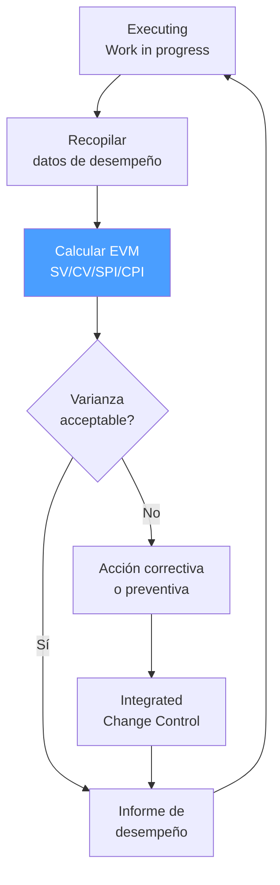

# /pm-monitoring — PMBOK: Monitoring & Controlling

> *"Monitoring without controlling is just watching a car drive off a cliff. The value of performance measurement is not the measurement itself — it's the corrective action it enables before the project goes too far off course."*

Ejecuta el **Grupo de Proceso Monitoring & Controlling** de PMBOK. Mide el rendimiento del proyecto con EVM, gestiona el Control de Cambios Integrado, controla el scope/schedule/cost/quality, e implementa acciones correctivas y preventivas.

**THYROX Stage:** Stage 11 TRACK/EVALUATE (corre en paralelo con Stage 10 IMPLEMENT).

**Outputs clave:** Work Performance Reports · Change Requests · Corrective/Preventive Actions.

---

## Ciclo de Monitoring & Controlling



## Pre-condición

Requiere: `{wp}/pm-planning.md` con:
- Baselines aprobadas: scope baseline, schedule baseline, cost baseline
- EAC inicial calculado para comparar con performance actual

---

## Cuándo usar este paso

- Durante toda la ejecución del proyecto — Monitoring & Controlling corre en paralelo con Executing
- En cada periodo de reporte (semanal, quincenal, mensual)
- Cuando se detecta una varianza significativa respecto a los baselines

## Cuándo NO usar este paso

- Sin baselines aprobadas — sin baseline no hay punto de comparación para medir varianzas
- Sin datos de trabajo completado — EVM sin datos reales es solo proyección

---

## Knowledge Areas activas en Monitoring & Controlling

| Knowledge Area | Proceso de Control |
|---------------|-------------------|
| Integration Management | Monitor and Control Project Work · Perform Integrated Change Control |
| Scope Management | Validate Scope · Control Scope |
| Schedule Management | Control Schedule |
| Cost Management | Control Costs |
| Quality Management | Control Quality |
| Resource Management | Control Resources |
| Communications Management | Monitor Communications |
| Risk Management | Monitor Risks |
| Procurement Management | Control Procurements (si aplica) |
| Stakeholder Management | Monitor Stakeholder Engagement |

---

## Actividades

### 1. Earned Value Management (EVM)

EVM es la herramienta de performance más poderosa de PMBOK. Integra scope, schedule y cost en una sola visión:

#### Variables fundamentales

| Variable | Nombre | Definición | Fórmula |
|----------|--------|-----------|---------|
| **PV** | Planned Value | Valor del trabajo planificado a la fecha de corte | Costo presupuestado del trabajo planificado |
| **EV** | Earned Value | Valor del trabajo realmente completado | % completado × Budget at Completion (BAC) |
| **AC** | Actual Cost | Costo real del trabajo completado a la fecha | Dato del sistema de costos |
| **BAC** | Budget at Completion | Presupuesto total del proyecto | Costo baseline total |

#### Métricas de varianza (negativo = problema)

| Métrica | Fórmula | Interpretación | Umbral de alerta |
|---------|---------|---------------|-----------------|
| **SV** | EV − PV | Varianza de cronograma en $ | SV < −10% del PV |
| **CV** | EV − AC | Varianza de costo en $ | CV < −10% del EV |
| **SPI** | EV / PV | Eficiencia del cronograma | SPI < 0.85 |
| **CPI** | EV / AC | Eficiencia del costo | CPI < 0.85 |

> **Regla de interpretación:** SPI/CPI = 1.0 es perfecto. > 1.0 es ahead of schedule / under budget. < 1.0 es behind schedule / over budget.

#### Métricas de proyección

| Métrica | Fórmula | Significado |
|---------|---------|------------|
| **EAC** (asumiendo CPI actual continúa) | BAC / CPI | Estimación más probable del costo total |
| **EAC** (con nueva estimación) | AC + ETC (bottom-up) | Cuando el CPI histórico no es representativo |
| **ETC** | EAC − AC | Cuánto más costará completar el proyecto |
| **VAC** | BAC − EAC | Varianza de costo al final del proyecto |
| **TCPI** (basado en BAC) | (BAC − EV) / (BAC − AC) | Eficiencia de costo necesaria para terminar dentro del presupuesto |
| **TCPI** (basado en EAC) | (BAC − EV) / (EAC − AC) | Eficiencia de costo necesaria para terminar dentro del EAC |

> **Interpretación de TCPI:** Si TCPI > 1.10, el presupuesto original (BAC) es prácticamente inalcanzable; reportar al sponsor y ajustar EAC.

> **ADVERTENCIA sobre causalidad:** EVM detecta correlaciones entre work performance y cost/schedule. Una SPI baja puede tener muchas causas (recursos insuficientes, scope mal estimado, impedimentos externos). EVM identifica QUÉ está pasando y con qué magnitud — no explica POR QUÉ. El análisis de causas requiere investigación adicional (conversaciones con el equipo, revisión del issue log, análisis de impedimentos).

### 2. Control Schedule

Además de la perspectiva EVM, controlar el cronograma en términos de actividades y hitos:

| Actividad | Descripción |
|-----------|-------------|
| **Actualizar el cronograma** | Reflejar el progreso real en el cronograma de actividades |
| **Analizar el Critical Path** | Identificar si hay actividades críticas con float negativo |
| **Análisis de compresión** | Si hay retraso: Fast Tracking (actividades en paralelo) o Crashing (agregar recursos) |
| **Forecast to completion** | Proyectar fecha de completion basada en progreso actual |

**Opciones de compresión del cronograma:**

| Técnica | Descripción | Riesgo |
|---------|-------------|--------|
| **Fast Tracking** | Poner actividades en paralelo que estaban en serie | Aumenta el riesgo de retrabajo por dependencias |
| **Crashing** | Agregar recursos al Critical Path para acelerar | Aumenta el costo; rendimientos decrecientes |

### 3. Perform Integrated Change Control

Todo cambio al scope, schedule o cost baseline debe pasar por el Change Control Board (CCB):

**Proceso de Change Control:**

| Paso | Descripción | Responsable |
|------|-------------|-------------|
| **Identificar cambio** | Cualquier miembro del equipo puede identificar una solicitud de cambio | Equipo / stakeholders |
| **Crear Change Request** | Documentar el cambio propuesto con impacto en scope/schedule/cost/quality | PM |
| **Evaluar impacto** | Analizar el impacto en todas las áreas del proyecto | PM + equipo técnico |
| **Presentar al CCB** | Presentar el Change Request al Change Control Board para decisión | PM |
| **Decisión CCB** | Approve / Reject / Defer | CCB |
| **Implementar si aprobado** | Actualizar el Project Management Plan y los baselines afectados | PM + equipo |
| **Comunicar decisión** | Notificar a todos los stakeholders afectados | PM |

**Change Request template:**

| Campo | Descripción |
|-------|-------------|
| **CR ID** | CR-001, CR-002, ... |
| **Solicitante** | Quién solicita el cambio |
| **Descripción** | Qué cambio se solicita |
| **Justificación** | Por qué se necesita el cambio |
| **Impacto en Scope** | Qué se agrega, modifica o elimina del scope |
| **Impacto en Schedule** | Días adicionales o reducción de tiempo |
| **Impacto en Cost** | Costo adicional o ahorro |
| **Impacto en Calidad** | Efecto sobre los criterios de calidad |
| **Riesgos** | Nuevos riesgos introducidos por el cambio |
| **Recomendación del PM** | Approve / Reject con justificación |
| **Decisión del CCB** | Aprobado / Rechazado / Diferido + fecha |

### 4. Control Quality (QC)

Quality Control inspecciona los deliverables para detectar defectos:

| Técnica | Cuándo usar | Output |
|---------|-------------|--------|
| **Inspección** | Todo deliverable antes de entregarlo | Defect log |
| **Testing** | Deliverables de software o sistemas | Test results |
| **Statistical sampling** | Cuando no es viable revisar el 100% (ej: manufactura) | Sample results + inferencia |
| **Checklist verification** | Verificar que todos los criterios de aceptación están cumplidos | Completed checklist |

> **QC detecta defectos; QA previene defectos.** Ambos son necesarios.

### 5. Monitor Risks

En Monitoring & Controlling, el Risk Register se revisa y actualiza periódicamente:

| Actividad | Frecuencia |
|-----------|-----------|
| Revisar estado de riesgos activos | Cada periodo de reporte |
| Verificar si triggers de riesgo se cumplieron | Continuo durante ejecución |
| Identificar nuevos riesgos emergentes | Continuo |
| Actualizar probabilidad/impacto de riesgos existentes | Cuando cambia el contexto |
| Ejecutar planes de respuesta para riesgos materializados | Cuando el riesgo ocurre |

---

## Umbrales de varianza y acciones

| Varianza | Acción requerida |
|---------|-----------------|
| SPI o CPI entre 0.90 y 1.10 | Monitoreo normal — no se requiere acción correctiva urgente |
| SPI o CPI entre 0.85 y 0.90 | Análisis de causa + plan de corrección — reportar al sponsor |
| SPI o CPI < 0.85 | Acción correctiva inmediata + Change Request si impacta baseline + escalación al sponsor |
| TCPI > 1.10 | Revisar EAC con el sponsor — el BAC original puede requerir ajuste formal |

---

## Artefacto esperado

`{wp}/pm-monitoring.md`

```yml
created_at: [timestamp]
project: [nombre]
work_package: [wp-id]
phase: pm:monitoring
reporting_period: [YYYY-MM-DD a YYYY-MM-DD]
author: [nombre]
status: Borrador
```

```markdown
## EVM — Periodo [YYYY-MM-DD]

| Variable | Valor |
|----------|-------|
| BAC | $ |
| PV | $ |
| EV | $ |
| AC | $ |
| SV (EV−PV) | $ |
| CV (EV−AC) | $ |
| SPI (EV/PV) | |
| CPI (EV/AC) | |
| EAC (BAC/CPI) | $ |
| ETC (EAC−AC) | $ |
| VAC (BAC−EAC) | $ |
| TCPI (BAC) | |

**Interpretación:**
[Análisis del estado del proyecto basado en EVM]

**Nota sobre causalidad:**
[Posibles causas de las varianzas observadas — requiere validación con el equipo]

## Schedule Control
- Hitos completados en periodo: [lista]
- Hitos retrasados: [lista con días de retraso]
- Float del Critical Path: [días]
- Acciones de compresión tomadas: [lista]

## Change Requests del periodo
| CR ID | Descripción | Estado CCB |

## Quality Control — resultados
| Deliverable | Técnica | Defectos encontrados | Estado |

## Risk Register — actualizaciones
| Risk ID | Cambio | Nuevo estado |

## Acciones correctivas/preventivas implementadas
| Acción | Causa | Impacto esperado | Responsable |

## RAG Status
- Scope: 🟢 / 🟡 / 🔴
- Schedule: 🟢 / 🟡 / 🔴
- Cost: 🟢 / 🟡 / 🔴
- Quality: 🟢 / 🟡 / 🔴
- Risks: 🟢 / 🟡 / 🔴
```

---

## Red Flags — señales de Monitoring mal ejecutado

- **EVM calculado pero sin acciones correctivas** — si el CPI es 0.72 y el PM no reporta ni actúa, el EVM se convierte en un ejercicio de documentación de la crisis, no en una herramienta de control
- **Baselines que se actualizan con cada varianza** — re-baseline cada vez que el proyecto se desvía elimina la capacidad de medir varianza; re-baseline solo se hace con aprobación formal del CCB cuando el proyecto tiene una causa legítima
- **Change Control bypasseado por urgencia** — "no tenemos tiempo para el proceso de change control" es la justificación más común para el scope creep no controlado
- **Riesgos que no se revisan** — el Risk Register de Planning sin actualizaciones durante Executing indica que no se está monitoreando activamente; los riesgos nuevos no se detectan
- **QC solo al final del proyecto** — Quality Control al final es costoso; detectar defectos en el penúltimo sprint antes de la entrega es mucho más caro que detectarlos al terminar cada deliverable

---

## Criterio de completitud

Monitoring & Controlling es **continuo** — no tiene completitud propia sino condiciones de cierre:

| Condición | Acción |
|-----------|--------|
| Todos los deliverables verificados y aceptados por QC | Activar `pm:closing` |
| Varianza crítica (SPI/CPI < 0.85) | Change Request + acción correctiva + continuar Monitoring |
| Todos los contratos cerrados (si aplica) | Iniciar `pm:closing` en paralelo |

---

## Estado en now.md

**Al INICIAR este step:**
```yaml
methodology_step: pm:monitoring
flow: pm
pm_process_group: monitoring_controlling
```

**Activo en paralelo con Executing:**
```yaml
methodology_step: pm:executing+monitoring
flow: pm
pm_process_group: executing+monitoring_controlling
```

**Al COMPLETAR** (todos los deliverables verificados → cierre):
```yaml
methodology_step: pm:monitoring  # completado → activar pm:closing
flow: pm
pm_process_group: monitoring_controlling
```

## Siguiente paso

- Todos los deliverables verificados y aceptados → `pm:closing`
- Varianza crítica detectada → Change Request + acción correctiva + continuar Monitoring

---

## Limitaciones

- EVM requiere que el proyecto tenga un presupuesto y cronograma baseline aprobado con suficiente granularidad para calcular % completado por actividad — sin esta granularidad, el EV es estimado y el EVM pierde precisión
- EVM en proyectos ágiles requiere adaptación: el "% completado" se mide por story points o features completados, no por horas; las métricas SPI/CPI aplican con la misma interpretación
- Las varianzas de schedule en EVM están en unidades monetarias ($), no en días — una varianza de schedule en $ no dice cuántos días está retrasado el proyecto; para eso se necesita el Schedule Network Analysis (Critical Path)
