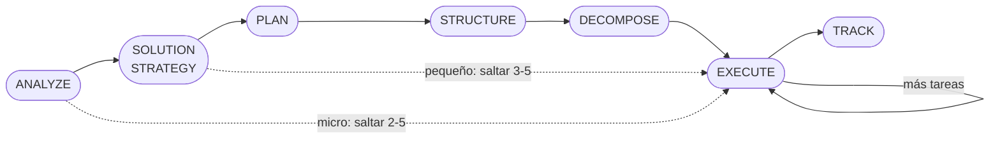

```yml
name: pm-thyrox
description: "Framework de gestión de proyectos con metodología SDLC de 7 fases. Usar este skill cuando el usuario quiera planificar, analizar, diseñar, organizar, trackear o gestionar CUALQUIER tipo de trabajo — features, bug fixes, refactoring, documentación, investigación o setup de proyecto. También usar cuando el usuario pregunte '¿qué hago primero?', '¿cómo organizo esto?', '¿cuál es el estado?', 'crea un plan para X', 'analiza X', 'descompón X en tareas', 'documenta esta decisión', o cualquier cosa relacionada con workflow de proyecto, tracking de trabajo, registros de decisiones o desarrollo estructurado. Siempre empezar con ANALYZE antes de planificar."
```

# PM-THYROX: Gestión de Proyectos

Framework de gestión para organizar trabajo de cualquier tamaño con Claude Code. Sigue una metodología de 7 fases donde entender viene antes que planificar, y planificar viene antes que ejecutar.

**Principio core:** Analizar antes de actuar. Cada fase produce artefactos que alimentan la siguiente. Saltar fases produce trabajo sin fundamento.

**Escala según tamaño del trabajo:**

| Tamaño | Duración | Fases activas | Qué omitir |
|--------|----------|---------------|------------|
| Micro | <30 min | 1, 6, 7 | Phases 2, 3, 4, 5 (spec y plan opcionales) |
| Pequeño | 30 min – 2h | 1, 2, 6, 7 | Phases 3, 4, 5 (no requiere plan formal) |
| Mediano | 2h – 8h | 1, 2, 3, 4, 5, 6, 7 | Ninguna — seguir las 7 fases completas |
| Grande | >8h | 1, 2, 3, 4, 5, 6, 7 | Ninguna — usar epic.md para agrupar features |

Ver [escalabilidad](references/scalability.md) para detalles y casos de borde.



---

## Las 7 Fases

### Phase 1: ANALYZE

Entender el problema antes de proponer soluciones evita construir lo incorrecto.

1. Investigar estos 8 aspectos — preguntar al usuario lo que no esté claro:
   - **Objetivo/Por qué** — ¿qué se quiere lograr y por qué importa?
   - **Stakeholders** — ¿quiénes son los usuarios y qué necesitan?
   - **Uso operacional** — ¿cómo se usará el sistema en la práctica?
   - **Atributos de calidad** — ¿qué importa más: velocidad, seguridad, confiabilidad?
   - **Restricciones** — ¿qué limita la solución (tech, tiempo, presupuesto)?
   - **Contexto/sistemas vecinos** — ¿dónde se sitúa, qué lo rodea?
   - **Fuera de alcance** — ¿qué NO se va a hacer?
   - **Criterios de éxito** — ¿cómo sabremos que está bien hecho?
2. Crear work package: obtener timestamp real ejecutando `date +%Y-%m-%d-%H-%M-%S` → crear `context/work/{timestamp}-nombre/`
   — NUNCA inventar ni estimar el timestamp. SIEMPRE obtenerlo del sistema antes de crear el directorio.
   — Este mismo comando aplica a TODOS los campos `Fecha` de cualquier artefacto (Fecha creación, Fecha actualización, Fecha cierre). NUNCA usar solo `YYYY-MM-DD` — siempre incluir `HH-MM-SS`.
3. REQUERIDO: Crear `work/.../analysis/{nombre-wp}-analysis.md` usando [introduction.md.template](assets/introduction.md.template)
   — el nombre del archivo debe revelar QUÉ se analiza. Ejemplo: `skill-activation-analysis.md`, no `introduction.md`
4. REQUERIDO: Crear `work/../{nombre-wp}-risk-register.md` usando [risk-register.md.template](assets/risk-register.md.template) — identificar riesgos desde el inicio. Actualizar en cada fase.
5. Si el análisis es complejo, crear sub-documentos en `work/.../analysis/` según necesidad:
   [stakeholders.md.template](assets/stakeholders.md.template) · [requirements-analysis.md.template](assets/requirements-analysis.md.template) · [use-cases.md.template](assets/use-cases.md.template) · [quality-goals.md.template](assets/quality-goals.md.template) · [constraints.md.template](assets/constraints.md.template) · [context.md.template](assets/context.md.template) · [basic-usage.md.template](assets/basic-usage.md.template)
   Si el análisis involucra >20 issues con severidades: [analysis-phase.md.template](assets/analysis-phase.md.template)
   Si el proyecto requiere metadata JSON estructurada (>50 issues): [project.json.template](assets/project.json.template) — opcional
6. Para proyectos medianos/grandes: Crear `work/../{nombre-wp}-exit-conditions.md` usando [exit-conditions.md.template](assets/exit-conditions.md.template) — checklist vivo de gates para las 7 fases. Actualizar al cerrar cada fase.
7. Si el proyecto define principios arquitectónicos globales que otras features deben respetar, crear/actualizar `constitution.md` en la raíz usando [constitution.md.template](assets/constitution.md.template)
8. ADR: **Dónde crear el ADR:**
   - SI CLAUDE.md del proyecto tiene campo `adr_path` → crear en ese path
   - SI NO → crear en `docs/architecture/decisions/` (default)

   Usar [adr.md.template](assets/adr.md.template) SOLO SI aplica alguno de estos casos:
   - SI: cambio de stack tecnologico (lenguaje, base de datos, framework principal)
   - SI: adopcion de nuevo patron arquitectonico (microservicios, event-driven, CQRS)
   - SI: reemplazo de componente principal del sistema
   - SI: decision que afecta todos los work packages futuros del proyecto
   - NO: convencion de naming, formato de archivo, o template nuevo
   - NO: decision que solo afecta el WP actual
   - NO: cambios a la metodologia de gestion (eso va en SKILL.md, no en un ADR)

Referencias de análisis por subsección (leer según necesidad):
[introduction](references/introduction.md) · [requirements-analysis](references/requirements-analysis.md) · [use-cases](references/use-cases.md) · [quality-goals](references/quality-goals.md) · [stakeholders](references/stakeholders.md) · [basic-usage](references/basic-usage.md) · [constraints](references/constraints.md) · [context](references/context.md)

**Salir cuando:** `work/.../analysis/{nombre-wp}-analysis.md` existe, no contiene `[NEEDS CLARIFICATION]`, y el usuario aprobó los hallazgos.
**Siguiente:** Proponer Phase 2. Si no requiere decisiones arquitectónicas, proponer saltar a Phase 3.
**Detectar:** Si `work/.../analysis/` contiene al menos un `*-analysis.md` sin `[NEEDS CLARIFICATION]`, Phase 1 ya completó.

### Phase 2: SOLUTION_STRATEGY

Investigar alternativas antes de decidir previene decisiones sin evidencia.

0. REQUERIDO: Leer [solution-strategy](references/solution-strategy.md) antes de empezar esta fase. Basar las Key Ideas en los hallazgos de `work/.../analysis/`.
1. REQUERIDO: Crear `work/../{nombre-wp}-solution-strategy.md` usando [solution-strategy.md.template](assets/solution-strategy.md.template)
   — Ejemplo: `skill-activation-solution-strategy.md`, no `solution-strategy.md`
2. **Key Ideas** — definir los conceptos centrales que guían la solución (basarse en analysis/ de Phase 1)
3. **Research** — listar unknowns → investigar alternativas → documentar pros/cons por cada uno
4. **Pre-design check** — verificar que las decisiones respetan los principios del proyecto
5. **Decisions** — documentar decisiones fundamentales con justificación. Usar [adr.md.template](assets/adr.md.template) para decisiones arquitectónicas
6. **Post-design re-check** — re-verificar después de diseñar (las decisiones pueden cambiar al profundizar)

Ver [solution-strategy](references/solution-strategy.md) para estructura completa (Tech Stack, Patterns, Quality Goals).

**Salir cuando:** Arquitectura aprobada con investigación documentada.
**Siguiente:** Proponer Phase 3: PLAN para definir scope y linkear work package en ROADMAP.
**Detectar:** Si `work/.../*-solution-strategy.md` existe con decisiones documentadas, Phase 2 ya completó.

### Phase 3: PLAN

Definir scope antes de estructurar previene scope creep.

1. Brainstorm: ¿qué problema? ¿quiénes son los usuarios? ¿qué es éxito? ¿qué está fuera?
2. Verificar que el work package existe: `ls context/work/`. Si no existe, volver a Phase 1 antes de continuar. Para trabajo grande que agrupa múltiples features, usar [epic.md.template](assets/epic.md.template)
3. REQUERIDO: Crear `work/../{nombre-wp}-plan.md` usando [plan.md.template](assets/plan.md.template) — scope statement, in-scope, out-of-scope explícito, estimación de esfuerzo
4. Actualizar ROADMAP.md con features y link al work package
5. SI el plan deriva de `analysis/` con RC formales → REQUERIDO: incluir tabla de trazabilidad RC→tarea en el plan antes de presentarlo al usuario. Cada RC de prioridad Alta o Media debe tener al menos una fila. NO presentar el plan si la tabla está incompleta.
   SI el plan no tiene RC formales (trabajo mecánico) → omitir la tabla.
6. Obtener aprobación del scope — NO declarar Phase 3 completa hasta confirmación explícita del usuario

**Nota DECOMPOSE:** SI el plan deriva de RC con prioridades distintas (Alta, Media, Baja) → Phase 5: DECOMPOSE NO puede saltarse, independientemente de la clasificación de tamaño en la tabla de escalabilidad. El criterio de tamaño aplica solo a WPs sin RC formales.

**Salir cuando:** `work/../{nombre-wp}-plan.md` existe con scope aprobado Y ROADMAP actualizado. SI hay RC formales: la tabla de trazabilidad RC→tarea existe y cada RC Alta/Media tiene al menos una tarea asignada.
**Siguiente:** Proponer Phase 4: STRUCTURE para especificar antes de descomponer.
**Detectar:** Si `work/.../*-plan.md` existe con `[x] Scope aprobado`, Phase 3 ya completó.

### Phase 4: STRUCTURE

Especificar antes de descomponer previene ambigüedad en las tareas.

**Simple** (<10 tareas): Crear `work/../{nombre-wp}-requirements-spec.md` usando [requirements-specification.md.template](assets/requirements-specification.md.template) con overview, user stories, acceptance criteria.
   — Ejemplo: `skill-activation-requirements-spec.md`, no `requirements-spec.md`
**Complejo** (10+ tareas): Ver [spec-driven-development](references/spec-driven-development.md). Además, crear `work/../{nombre-wp}-design.md` usando [design.md.template](assets/design.md.template) — visión arquitectónica, componentes afectados, decisiones de diseño.

REQUERIDO: Completar [spec-quality-checklist.md.template](assets/spec-quality-checklist.md.template) ANTES de Phase 5. NO avanzar si quedan ítems sin ✓ o marcadores `[NEEDS CLARIFICATION]` sin resolver — la ambigüedad en specs se multiplica en la implementación.
Para documentos técnicos que no tienen template específico: [document.md.template](assets/document.md.template)

**Salir cuando:** `work/.../*-requirements-spec.md` existe, no contiene `[NEEDS CLARIFICATION]`, y checklist completado al 100%.
**Siguiente:** Proponer Phase 5: DECOMPOSE para crear tareas atómicas.
**Detectar:** Si `work/.../*-requirements-spec.md` tiene user stories y acceptance criteria sin `[NEEDS CLARIFICATION]`, Phase 4 ya completó.

### Phase 5: DECOMPOSE

Tareas atómicas con trazabilidad previenen trabajo duplicado o perdido.

1. Leer `work/.../*-requirements-spec.md` del work package activo (= directorio más reciente en `context/work/`). Si el usuario pide descomposición directa sin spec previo,
   crear work package y descomponer desde la descripción del usuario — no cuestionar si el proyecto existe en el repo
2. REQUERIDO: Crear `work/../{nombre-wp}-task-plan.md` usando [tasks.md.template](assets/tasks.md.template)
   — Ejemplo: `skill-activation-task-plan.md`, no `task-plan.md`
3. Crear lista de tareas con IDs trazables — cada tarea necesita un ID y referencia a su requisito
   porque esto permite detectar tareas huérfanas (sin requisito) o requisitos sin cobertura.
   Formato: `- [ ] [T-NNN] Descripción (R-N)`
4. Marcar tareas paralelas [P]
5. Definir checkpoints de validación
   Si hay >50 issues antes de descomponer: [categorization-plan.md.template](assets/categorization-plan.md.template) — categorizar primero para identificar grupos naturales

**Salir cuando:** `work/.../*-task-plan.md` existe con tareas atómicas y orden definido.
**Siguiente:** Proponer Phase 6: EXECUTE para implementar.
**Detectar:** Si `work/.../*-task-plan.md` tiene checkboxes `- [ ] [T-NNN]`, Phase 5 ya completó.

### Phase 6: EXECUTE

Commits frecuentes con mensajes descriptivos crean un historial navegable.

1. Tomar siguiente tarea pendiente de `work/.../*-task-plan.md` (checkbox `- [ ]`) sin bloqueos
2. REQUERIDO al inicio de sesión: Crear o actualizar `work/../{nombre-wp}-execution-log.md` usando [execution-log.md.template](assets/execution-log.md.template)
3. Implementar el cambio
4. Si la implementación falla, crear `context/errors/ERR-NNN-descripcion.md` usando [error-report.md.template](assets/error-report.md.template) antes de reintentar con otro approach
5. No commitear archivos temporales, binarios ni backups — usar /tmp/ para efímeros
6. Commit con [Conventional Commits](references/commit-helper.md): `type(scope): description`
7. Actualizar ROADMAP.md: `[ ]` → `[x]` con fecha
8. Repetir hasta completar todas las tareas
   Para trabajo micro (<30 min) sin WP: [ad-hoc-tasks.md.template](assets/ad-hoc-tasks.md.template) — registrar sin crear work package completo

**Salir cuando:** Todas las tareas completadas y commiteadas.
**Siguiente:** Proponer Phase 7: TRACK para documentar lecciones.
**Detectar:** Si todas las checkboxes en `*-task-plan.md` están `[x]`, Phase 6 ya completó.

### Phase 7: TRACK

Documentar lecciones previene repetir los mismos errores.

- Revisar progreso desde ROADMAP.md + commits recientes. Si hay work package activo con task-plan.md,
  identificar la siguiente tarea incompleta y sugerirla como acción concreta
- REQUERIDO: Crear `work/../{nombre-wp}-lessons-learned.md` usando [lessons-learned.md.template](assets/lessons-learned.md.template)
  — Ejemplo: `skill-activation-lessons-learned.md`, no `lessons-learned.md`
- REQUERIDO: Generar [CHANGELOG](CHANGELOG.md) desde commits usando [changelog.md.template](assets/changelog.md.template)
- Actualizar `work/.../risk-register.md`: cerrar riesgos resueltos, documentar los que se materializaron
- Para proyectos grandes o con métricas relevantes: crear `work/../{nombre-wp}-final-report.md` usando [final-report.md.template](assets/final-report.md.template) — resumen ejecutivo, estimado vs real, métricas
- Para tracking de deuda técnica identificada: [refactors.md.template](assets/refactors.md.template)
- Si hay 100+ issues: ver [incremental-correction](references/incremental-correction.md)
- Validar integridad: ver [reference-validation](references/reference-validation.md)
- Gate soft antes de avanzar de fase: `bash scripts/validate-phase-readiness.sh <phase>`
- Verificar que no quedaron archivos temporales fuera de `context/work/`
- Validar cierre de sesión: `bash scripts/validate-session-close.sh`
- Resumen rápido del estado: `bash scripts/project-status.sh`

**Salir cuando:** Análisis completo y lecciones documentadas.

---

## Dónde viven los artefactos

| Fase | Artefacto | Ubicación | Template |
|------|-----------|-----------|----------|
| 1 | Síntesis de análisis | `work/.../analysis/{nombre-wp}-analysis.md` | [introduction.md.template](assets/introduction.md.template) |
| 1 | Registro de riesgos | `work/../{nombre-wp}-risk-register.md` | [risk-register.md.template](assets/risk-register.md.template) |
| 1 | Sub-análisis (opcional) | `work/.../analysis/*.md` | stakeholders, requirements-analysis, use-cases, quality-goals, constraints, context, basic-usage |
| 1 | Gates de 7 fases (mediano/grande) | `work/../{nombre-wp}-exit-conditions.md` | [exit-conditions.md.template](assets/exit-conditions.md.template) |
| 1 | Principios globales del proyecto | `constitution.md` (raíz) | [constitution.md.template](assets/constitution.md.template) |
| 1–2 | Decisiones arquitectónicas | `{adr_path}/adr-NNN.md` (ver CLAUDE.md o default `docs/architecture/decisions/`) | [adr.md.template](assets/adr.md.template) |
| 1 | Work package | `context/work/YYYY-MM-DD-HH-MM-SS-nombre/` | — |
| 2 | Estrategia de solución | `work/../{nombre-wp}-solution-strategy.md` | [solution-strategy.md.template](assets/solution-strategy.md.template) |
| 3 | Scope del trabajo | `work/../{nombre-wp}-plan.md` | [plan.md.template](assets/plan.md.template) |
| 4 | Especificación de requisitos | `work/../{nombre-wp}-requirements-spec.md` | [requirements-specification.md.template](assets/requirements-specification.md.template) |
| 4 | Diseño técnico (complejo) | `work/../{nombre-wp}-design.md` | [design.md.template](assets/design.md.template) |
| 5 | Plan de tareas | `work/../{nombre-wp}-task-plan.md` | [tasks.md.template](assets/tasks.md.template) |
| 6 | Log de ejecución | `work/../{nombre-wp}-execution-log.md` | [execution-log.md.template](assets/execution-log.md.template) |
| 6 | Código | Repositorio (git) | — |
| 7 | Lecciones aprendidas | `work/../{nombre-wp}-lessons-learned.md` | [lessons-learned.md.template](assets/lessons-learned.md.template) |
| 7 | Changelog | [CHANGELOG](CHANGELOG.md) | [changelog.md.template](assets/changelog.md.template) |
| 7 | Reporte final (grande) | `work/../{nombre-wp}-final-report.md` | [final-report.md.template](assets/final-report.md.template) |
| 1 | Análisis por severidad (>20 issues) | `work/.../analysis/{nombre}-analysis-phase.md` | [analysis-phase.md.template](assets/analysis-phase.md.template) — opcional |
| 1 | Metadata JSON del proyecto (>50 issues) | `work/../project.json` | [project.json.template](assets/project.json.template) — opcional |
| 4 | Documento técnico genérico | `work/../{nombre}-document.md` | [document.md.template](assets/document.md.template) — cuando no aplica template específico |
| 5 | Categorización de issues (>50) | `work/../{nombre}-categorization-plan.md` | [categorization-plan.md.template](assets/categorization-plan.md.template) — opcional |
| 5/6 | Tareas ad-hoc (<2h, sin WP) | `ad-hoc-tasks.md` | [ad-hoc-tasks.md.template](assets/ad-hoc-tasks.md.template) — opcional |
| 5/6 | Tracking de deuda técnica | `refactors.md` | [refactors.md.template](assets/refactors.md.template) — opcional |
| — | Errores | `context/errors/ERR-NNN-descripcion.md` | [error-report.md.template](assets/error-report.md.template) |

## Estructura de un work package

```
context/work/YYYY-MM-DD-HH-MM-SS-nombre/
├── analysis/
│   ├── {nombre}-analysis.md          ← Síntesis del análisis (Phase 1) — REQUERIDO
│   └── {nombre}-{subtema}.md         ← Sub-análisis opcionales (stakeholders, constraints, etc.)
├── {nombre}-risk-register.md         ← Riesgos vivos Phase 1→6 — REQUERIDO
├── {nombre}-exit-conditions.md       ← Gates de las 7 fases (Phase 1, mediano/grande)
├── {nombre}-solution-strategy.md     ← Estrategia arquitectónica (Phase 2)
├── {nombre}-plan.md                  ← Scope aprobado (Phase 3)
├── {nombre}-requirements-spec.md     ← Especificación de requisitos (Phase 4)
├── {nombre}-design.md                ← Diseño técnico (Phase 4, complejo)
├── {nombre}-task-plan.md             ← Tareas con checkboxes (Phase 5) — REQUERIDO
├── {nombre}-execution-log.md         ← Log de sesiones de ejecución (Phase 6)
├── {nombre}-lessons-learned.md       ← Lecciones aprendidas (Phase 7) — REQUERIDO
└── {nombre}-final-report.md          ← Reporte final con métricas (Phase 7, grande)
```

**Convención de nombres — OBLIGATORIO:**
`{nombre}` = parte descriptiva del work package (sin timestamp).
Ejemplo: WP `2026-04-01-22-15-43-template-phase-integration` → `{nombre}` = `template-phase-integration`
El nombre del archivo debe revelar QUÉ contiene, no solo QUÉ tipo es.

No todos los paquetes necesitan todos los archivos. Un fix rápido puede tener solo plan.md.

**Cuándo crear un work package:**
- Trabajo involucra múltiples archivos o fases
- Tiene consecuencias de decisión
- Dura más de 30 minutos
- Produce lecciones

## Naming

```
Archivos:        kebab-case.md
Work packages:   YYYY-MM-DD-HH-MM-SS-nombre/   ← timestamp real: `date +%Y-%m-%d-%H-%M-%S`
Commits:         type(scope): description
ADRs:            adr-NNN.md
Tareas:          [T-NNN] Descripción (R-N)
Errores:         ERR-NNN-descripcion.md
```

**Artefactos de work package — patrón `{nombre-wp}-{tipo}.md`:**

```
{nombre-wp} = parte descriptiva del WP (sin timestamp)
{tipo}      = analysis | solution-strategy | plan | requirements-spec | design |
              task-plan | execution-log | lessons-learned | risk-register |
              exit-conditions | final-report | spec-checklist

Ejemplo: WP "2026-04-02-10-00-00-pagos-stripe"
  → analysis/pagos-stripe-analysis.md
  → pagos-stripe-solution-strategy.md
  → pagos-stripe-task-plan.md
  → pagos-stripe-lessons-learned.md

Excepción: CHANGELOG.md — nombre global, convención universal (Keep a Changelog)
```

> WPs anteriores a 2026-04-02 usan naming legacy (`spec.md`, `plan.md`, `lessons.md`).
> No se migran. El patrón `{nombre-wp}-{tipo}.md` aplica a WPs nuevos.

Ver [conventions](references/conventions.md) para detalles completos.

---

## References por dominio

### Phase 1: ANALYZE (leer cuando se investiga un problema)
[introduction](references/introduction.md) · [requirements-analysis](references/requirements-analysis.md) · [use-cases](references/use-cases.md) · [quality-goals](references/quality-goals.md) · [stakeholders](references/stakeholders.md) · [basic-usage](references/basic-usage.md) · [constraints](references/constraints.md) · [context](references/context.md)

### Phase 2: SOLUTION (leer cuando se toman decisiones arquitectónicas)
[solution-strategy](references/solution-strategy.md)

### Phase 4: STRUCTURE (leer cuando se crean especificaciones complejas)
[spec-driven-development](references/spec-driven-development.md)

### Phase 6: EXECUTE (leer cuando se hacen commits)
[commit-helper](references/commit-helper.md) · [commit-convention](references/commit-convention.md)

### Phase 7: TRACK (leer cuando se valida o corrige)
[reference-validation](references/reference-validation.md) · [incremental-correction](references/incremental-correction.md)

### Cross-phase (leer según necesidad)
[conventions](references/conventions.md) — Convenciones de archivos, commits, ROADMAP
[scalability](references/scalability.md) — Cómo escalar el framework según complejidad
[examples](references/examples.md) — 8 casos de uso reales

### Avanzado (leer cuando Claude tiene dificultades)
[prompting-tips](references/prompting-tips.md) — Cuando Claude no entiende instrucciones
[long-context-tips](references/long-context-tips.md) — Documentos >5,000 palabras
[skill-authoring](references/skill-authoring.md) — Crear o mejorar skills
