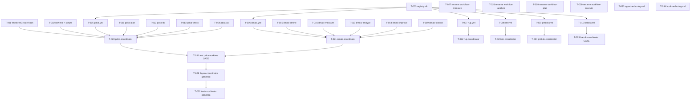

```yml
created_at: 2026-04-16 19:37:46
project: THYROX
work_package: 2026-04-16-18-54-38-multi-methodology
phase: Stage 8 — PLAN EXECUTION
author: NestorMonroy
status: Aprobado
```

# Task Plan — multi-methodology (ÉPICA 40)

## DAG de dependencias



**Ruta crítica:** T-001 → T-003 → T-005 → T-011..T-014 → T-020 → T-031 → T-026 → T-032

---

## Grupo 1 — Infraestructura base

- [ ] [T-001] Agregar `WorktreeCreate` y `WorktreeRemove` a `hooks/hooks.json` (GAP-007)
- [ ] [T-002] Extender `now.md` con campos `stage`, `flow`, `methodology_step` + actualizar `session-start.sh` y `validate-session-close.sh`
- [ ] [T-003] Crear directorio `.thyrox/registry/methodologies/` con `README.md` explicando el schema
- [ ] [T-004] Actualizar `session-start.sh` — leer y mostrar `stage` + `methodology_step` en el banner de sesión

## Grupo 2 — Registry YAML (6 metodologías)

> Requiere T-003. Se pueden crear en paralelo entre sí.

- [ ] [T-005] Crear `.thyrox/registry/methodologies/pdca.yml` — tipo cíclico, 4 pasos
- [ ] [T-006] Crear `.thyrox/registry/methodologies/dmaic.yml` — tipo secuencial, 5 pasos
- [ ] [T-007] Crear `.thyrox/registry/methodologies/rup.yml` — tipo iterativo, 4 fases × N iteraciones
- [ ] [T-008] Crear `.thyrox/registry/methodologies/rm.yml` — tipo secuencial con retorno, 5 pasos
- [ ] [T-009] Crear `.thyrox/registry/methodologies/pmbok.yml` — tipo secuencial, 5 grupos de proceso
- [ ] [T-010] Crear `.thyrox/registry/methodologies/babok.yml` — tipo no-secuencial, 6 knowledge areas

## Grupo 3 — Skills de metodología base

> Requiere T-003. Paralelo con Grupo 2.

### PDCA (4 skills)
- [ ] [T-011] Crear `.claude/skills/pdca-plan/SKILL.md` — Plan: identificar problema y diseñar mejora
- [ ] [T-012] Crear `.claude/skills/pdca-do/SKILL.md` — Do: ejecutar el plan a escala pequeña
- [ ] [T-013] Crear `.claude/skills/pdca-check/SKILL.md` — Check: verificar resultados vs objetivos
- [ ] [T-014] Crear `.claude/skills/pdca-act/SKILL.md` — Act: estandarizar si exitoso, ajustar si no

### DMAIC (5 skills)
- [ ] [T-015] Crear `.claude/skills/dmaic-define/SKILL.md` — Define: alcance del problema
- [ ] [T-016] Crear `.claude/skills/dmaic-measure/SKILL.md` — Measure: baseline cuantitativo del proceso
- [ ] [T-017] Crear `.claude/skills/dmaic-analyze/SKILL.md` — Analyze: causas raíz estadísticas
- [ ] [T-018] Crear `.claude/skills/dmaic-improve/SKILL.md` — Improve: implementar soluciones validadas
- [ ] [T-019] Crear `.claude/skills/dmaic-control/SKILL.md` — Control: sostener las mejoras

## Grupo 4 — Coordinators Patrón 3

> Requiere YAML + skills correspondientes. PDCA y DMAIC primero.

- [ ] [T-020] Crear `.claude/agents/pdca-coordinator.md` con `isolation: worktree`, `background: true` (requiere T-005, T-011..T-014)
- [ ] [T-021] Crear `.claude/agents/dmaic-coordinator.md` (requiere T-006, T-015..T-019)
- [ ] [T-022] Crear `.claude/agents/rup-coordinator.md` (requiere T-007)
- [ ] [T-023] Crear `.claude/agents/rm-coordinator.md` (requiere T-008)
- [ ] [T-024] Crear `.claude/agents/pmbok-coordinator.md` (requiere T-009)
- [ ] [T-025] Crear `.claude/agents/babok-coordinator.md` con lógica no-secuencial especial (requiere T-010) **[GATE: revisar lógica de routing antes de continuar]**

## Grupo 5 — Coordinator genérico Patrón 5

> Requiere T-031 (test del contrato validado con PDCA real).

- [ ] [T-026] Crear `.claude/agents/thyrox-coordinator.md` — coordinator genérico que lee `.thyrox/registry/methodologies/{flow}.yml` dinámicamente (requiere T-031)

## Grupo 6 — Renaming de stages conflictivos

> Independiente. Se puede ejecutar en paralelo con Grupo 4.

- [ ] [T-027] Renombrar `workflow-measure` → `workflow-baseline`: directorio, SKILL.md, referencias internas, skills list en settings
- [ ] [T-028] Renombrar `workflow-analyze` → `workflow-diagnose`: mismo proceso
- [ ] [T-029] Renombrar `workflow-plan` → `workflow-scope`: mismo proceso
- [ ] [T-030] Renombrar `workflow-execute` → `workflow-implement`: mismo proceso

## Grupo 7 — Validación y documentación

- [ ] [T-031] Test de `pdca-coordinator` con `isolation: worktree` — verificar que crea worktree, ejecuta pdca:plan, actualiza `now.md::methodology_step`, limpia worktree **[GATE: validar contrato antes de Patrón 5]**
- [ ] [T-032] Test de `thyrox-coordinator` — verificar que lee `pdca.yml` y `dmaic.yml` dinámicamente y presenta transiciones correctas
- [ ] [T-033] Actualizar `.claude/references/agent-authoring.md` — agregar `isolation: worktree`, `background: true`, ejemplos de coordinator
- [ ] [T-034] Actualizar `.claude/references/hook-authoring.md` — agregar `WorktreeCreate`/`WorktreeRemove` con ejemplo

---

## Stopping Point Manifest

| SP | Tarea | Condición de parada |
|----|-------|---------------------|
| SP-01 | T-002 | `now.md` extendido rompe el hook de sesión → revisar antes de continuar |
| SP-02 | T-025 | BABOK coordinator — lógica no-secuencial requiere aprobación de diseño |
| SP-03 | T-031 | Test de worktree isolation — validar contrato antes de Patrón 5 **[GATE]** |

---

## Estimación

| Grupo | Tareas | Complejidad | Orden |
|-------|--------|-------------|-------|
| 1 — Infraestructura | T-001..T-004 | Media | 1º |
| 2 — Registry YAMLs | T-005..T-010 | Baja | 2º (paralelo c/ G3) |
| 3 — Skills base | T-011..T-019 | Media | 2º (paralelo c/ G2) |
| 4 — Coordinators | T-020..T-025 | Media-Alta | 3º |
| 5 — Coordinator genérico | T-026 | Alta | 4º |
| 6 — Renaming | T-027..T-030 | Media | 3º (paralelo c/ G4) |
| 7 — Validación | T-031..T-034 | Media | 5º |

**Total: 34 tareas**
