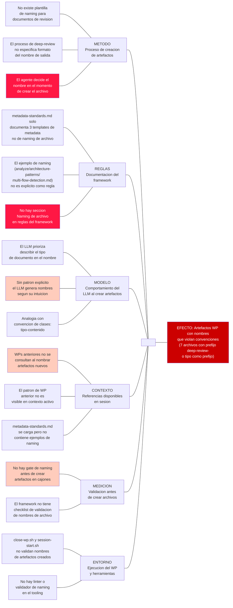

```yml
created_at: 2026-04-17 21:05:06
project: THYROX
work_package: 2026-04-17-17-58-13-goto-problem-fix
phase: Phase 3 — DIAGNOSE
author: NestorMonroy
status: Borrador
type: Ishikawa Analysis
efecto: Artefactos en cajones del WP tienen nombres que violan las convenciones del framework (prefijo deep-review- y tipo como prefijo)
dominio: Organizacional
variante_6m: Estándar
causas_raiz: 3
```

# Ishikawa: Nombres de artefactos WP violan convenciones del framework

## Efecto analizado

7 de 12 artefactos en `.thyrox/context/work/2026-04-17-17-58-13-goto-problem-fix/` tienen nombres que comienzan con `deep-review-` o usan el tipo de documento como prefijo en lugar del contenido como descriptor. Ningún WP anterior (plugin-distribution, multi-methodology) usa ese patrón. La regla en `metadata-standards.md` describe el naming como `{nombre-descriptivo}.md` sin prefijo de tipo.

## Diagrama



## Analisis por categoria (6M)

### Metodo — Proceso de creacion de artefactos

- **No existe plantilla de naming para documentos de revision**: El framework define templates de metadata (campos yml) pero no templates de nombre de archivo para artefactos de tipo "revision" o "deep-review". El ejecutor sabe que el documento es una revision pero no hay guia de como traducir eso al nombre del archivo.
  - Sub-causa: El proceso de deep-review es invocado como tarea, no como workflow con output especificado.
- **El agente decide el nombre en el momento**: Sin instruccion explicita de naming en la tarea que genera el artefacto, el LLM construye el nombre aplicando su propia heuristica (tipo primero, contenido despues).

### Reglas — Documentacion del framework

- **metadata-standards.md define templates de metadata, no de nombre de archivo**: La regla central del framework para artefactos WP (metadata-standards.md) se enfoca exclusivamente en el contenido del bloque yml. El naming del archivo aparece solo como ejemplo incidental (`analyze/architecture-patterns/multi-flow-detection.md`) sin declararse como patron.
  - Sub-causa: La regla fue escrita cuando el patron era evidente — los WPs anteriores nunca usaron prefijos de tipo. La excepcion no se previo como necesaria de documentar.
- **No existe seccion "Naming de archivo" en las reglas**: En `.claude/rules/` no hay ninguna regla que diga explicitamente "el nombre del archivo es {contenido}.md, nunca {tipo}-{contenido}.md".

### Modelo — Comportamiento del LLM al crear artefactos

- **El LLM prioriza el tipo en el nombre cuando no hay patron explicito**: Ante la ambiguedad, el LLM aplica una heuristica de programacion (nombre descriptivo del tipo + contenido) que es correcta en otros contextos (nombres de clases, funciones) pero incorrecta en el framework THYROX donde el cajон ya provee el contexto de tipo.
  - Sub-causa: `analyze/` ya dice que el contenido es un analisis. Poner `deep-review-` como prefijo es informacion redundante que el LLM no reconoce como redundante sin contexto explicito.
- **Sin patron de referencia activo, el LLM genera nombres por intuicion**: Los WPs anteriores no estan en el contexto activo de la sesion, por lo que el modelo no puede aprender del patron existente de forma implicita.

### Contexto — Referencias disponibles en sesion

- **WPs anteriores no se consultan al nombrar artefactos nuevos**: El flujo de sesion (CLAUDE.md) no incluye un paso "consultar WPs anteriores para inferir convencion de naming antes de crear artefactos".
  - Sub-causa: La consulta de WPs anteriores es costosa en contexto y no esta en el flujo obligatorio.
- **El patron establecido en WPs anteriores no es visible en el contexto activo**: En multi-methodology y plugin-distribution los artefactos siguen el patron `{contenido}-{tipo-opcional}.md` (ej: `comprehensive-gap-analysis.md`, `pattern-decision-deep-review.md`), pero este patron solo es visible si se listan esos WPs explicitamente.

### Medicion — Validacion antes de crear archivos

- **No hay gate de naming antes de crear artefactos**: El framework tiene gates de fase (exit-criteria) pero no micro-gates de naming antes de crear cada archivo individual.
- **El framework no tiene checklist de validacion de nombres**: A diferencia del metadata (que tiene template explicito), el nombre del archivo no tiene criterio de aceptacion documentado.

### Entorno — Tooling y scripts

- **Los scripts de sesion no validan nombres de artefactos**: `session-start.sh`, `session-resume.sh` y `close-wp.sh` gestionan estado de sesion y git, pero no incluyen logica de validacion de nombres de archivos creados en el WP.
- **No hay linter de naming en el tooling**: El proyecto no tiene ninguna herramienta que valide patrones de naming en `.thyrox/context/work/`.

## Causas raiz — 5 Porques

### Causa raiz 1: Ausencia de regla explicita de naming en el framework

| Por que | Respuesta |
|---------|-----------|
| Por que los archivos tienen nombres con prefijo de tipo? | El agente que los creo no tenia una regla explicita que prohiba el prefijo de tipo |
| Por que no habia una regla explicita? | metadata-standards.md documenta formato de metadata (campos yml) pero no formato de nombre de archivo |
| Por que metadata-standards.md no incluye naming? | La regla fue escrita cuando el patron era obvio — WPs anteriores nunca usaron prefijos de tipo, no se previo la excepcion |
| Por que no se previo la excepcion? | El patron "contenido primero, tipo omitido o al final" no fue declarado como invariante, solo era practica implicita |
| Causa raiz accionable | Agregar seccion "Naming de archivo" en metadata-standards.md que declare el patron explicito: `{contenido-descriptivo}.md`, sin prefijos de tipo |

### Causa raiz 2: El LLM aplica heuristica de programacion en ausencia de patron

| Por que | Respuesta |
|---------|-----------|
| Por que el agente genero `deep-review-audit-coverage.md` en lugar de `audit-coverage-review.md`? | El LLM uso heuristica "tipo primero" que es correcta en nombres de clase/funcion |
| Por que aplico esa heuristica? | No habia patron de referencia disponible en el contexto activo de la sesion |
| Por que no habia patron de referencia? | El flujo de sesion no instruye a consultar WPs anteriores para inferir convenciones de naming |
| Por que no esta en el flujo? | El flujo prioriza continuidad del WP activo, no aprendizaje de patrones de WPs historicos |
| Causa raiz accionable | Incluir en el prompt de creacion de artefactos (o en metadata-standards.md) un ejemplo explicito del patron correcto con un contraejemplo del patron incorrecto |

### Causa raiz 3: El cajon provee contexto de tipo — el nombre no debe repetirlo

| Por que | Respuesta |
|---------|-----------|
| Por que `analyze/deep-review-audit-coverage.md` es redundante? | `analyze/` ya dice que es un analisis — `deep-review-` repite informacion ya codificada en el cajon |
| Por que el agente no reconocio la redundancia? | No habia una regla que conectara el concepto "el cajon es el tipo" con "el nombre es solo el contenido" |
| Por que no existia esa conexion documentada? | La arquitectura de cajones se documento como convencion de ubicacion, no como convencion de naming |
| Causa raiz accionable | Documentar en metadata-standards.md el principio: "el cajon es el tipo — el nombre del archivo es solo el contenido" |

## Tabla de renombrado

Patron correcto: `{contenido-descriptivo}.md` — el cajon provee el contexto de tipo.
Si el tipo aporta informacion no capturada por el cajon, va al final: `{contenido}-{tipo}.md`.

| Archivo actual | Problema | Nombre correcto | Razon |
|----------------|----------|-----------------|-------|
| `discover/deep-review-references-relevance.md` | Prefijo de tipo como primer segmento | `discover/references-relevance-review.md` | El cajon `discover/` contextualiza; el contenido es "references-relevance"; el tipo "review" al final si se desea retenerlo |
| `discover/deep-review-use-cases-analysis.md` | Prefijo de tipo como primer segmento | `discover/use-cases-analysis.md` | `-analysis` ya dice el tipo; `deep-review-` es redundante y va primero |
| `analyze/deep-review-audit-coverage.md` | Prefijo de tipo como primer segmento | `analyze/audit-coverage-review.md` | Contenido: "audit-coverage"; tipo: "review" al final |
| `analyze/deep-review-discover-to-diagnose.md` | Prefijo de tipo como primer segmento | `analyze/discover-to-diagnose-coverage.md` | Contenido: cobertura Stage 1 → Stage 3; tipo omitido o al final |
| `analyze/deep-review-final-validation.md` | Prefijo de tipo como primer segmento | `analyze/final-validation-review.md` | Contenido: "final-validation"; tipo al final |
| `analyze/deep-review-task-plan-coverage.md` | Prefijo de tipo como primer segmento | `analyze/task-plan-coverage-review.md` | Contenido: "task-plan-coverage"; tipo al final |

**Artefactos correctamente nombrados (referencia positiva):**

| Archivo | Por que es correcto |
|---------|---------------------|
| `discover/goto-problem-fix-analysis.md` | Patron `{wp-name}-{tipo}.md` — tipo al final, contenido primero |
| `analyze/goto-problem-fix-diagnose.md` | Idem — tipo al final |
| `plan/goto-problem-fix-plan.md` | Idem |
| `strategy/goto-problem-fix-strategy.md` | Idem |
| `plan-execution/goto-problem-fix-task-plan.md` | Idem |

## Acciones correctivas

| Prioridad | Causa raiz | Accion | Responsable | Plazo |
|-----------|-----------|--------|-------------|-------|
| 1 (critica) | Ausencia de regla explicita de naming | Agregar seccion "Naming de archivos en cajones" a `metadata-standards.md` con patron explicito, contraejemplo y tabla de ejemplos correctos | NestorMonroy | Inmediato — antes de cerrar EPICA 41 |
| 2 (alta) | LLM usa heuristica sin patron de referencia | Renombrar los 6 archivos mal nombrados en el WP activo usando la tabla de renombrado | NestorMonroy | Inmediato — antes de Stage 10 IMPLEMENT |
| 3 (alta) | Cajon provee tipo — nombre no debe repetirlo | Documentar el principio en metadata-standards.md: "el cajon es el tipo" | NestorMonroy | En la misma edicion de la accion 1 |
| 4 (media) | Sin gate de validacion de naming | Agregar item de naming al checklist de gate Stage 1 → Stage 3 en SKILL.md | NestorMonroy | Mediano plazo — proxima EPICA |

## Sintesis

La causa raiz principal es la **ausencia de una regla explicita de naming en el framework**. `metadata-standards.md` es exhaustivo en el formato de bloques yml (metadata) pero no contiene ninguna instruccion sobre como construir el nombre del archivo. El patron correcto — contenido primero, tipo omitido o al final, cajon como contexto de tipo — existia como practica implicita en todos los WPs anteriores (multi-methodology, plugin-distribution) pero nunca fue declarado como invariante.

La accion de mayor impacto no es renombrar los 6 archivos del WP actual (eso es remediacion puntual) sino agregar la seccion de naming a `metadata-standards.md`. Una vez documentado el patron explicito con contraejemplo, el LLM tendra la referencia necesaria en su contexto activo para aplicar el patron correcto desde la primera vez. El principio clave a documentar es: "el cajon ya dice el tipo — el nombre del archivo describe solo el contenido".

Los renombrados del WP activo deben ejecutarse antes de Stage 10 IMPLEMENT para que los artefactos de analisis que se referencian en el task plan tengan los nombres correctos y el historial git refleje la convencion correcta desde este WP en adelante.
